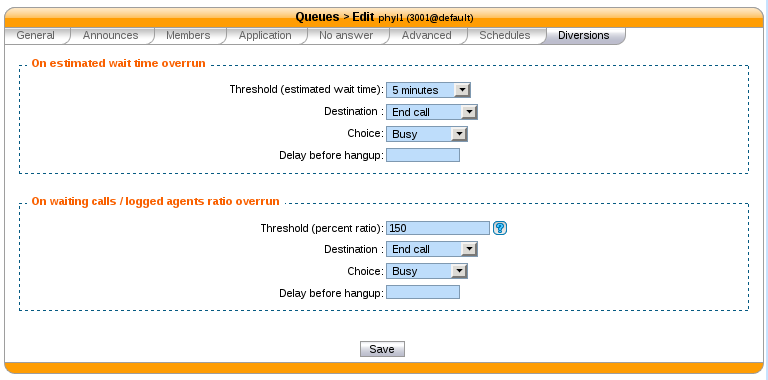

******
Queues
******

Call queues are used to distribute calls to the agents subscribed to the queue.  Queues are managed on the
:menuselection:`Services --> Call Center --> Queues` page.

.. figure:: add-queue.png
   :scale: 85%

   :menuselection:`Services --> Call Center --> Queues --> Add`

A queue can be configured with the following options:

   * Name : used as an unique id, cannot be ``general``
   * Display name : Displayed on the supervisor screen

A ring strategy defines how queue members are called when a call enters the queue. 
A queue can use one of the following ring strategies:

   * Linear: for each call, call the first member, then the second, etc.
   * Least recent: call the member who has least recently hung up a call.
   * Fewest calls: call the member with the fewest completed calls.
   * Round robin memory: call the "next" member after the one who answered.
   * Random: call a member at random
   * Weight random: same as random, but taking the member penalty into account.
   * Ring all: call all members at the same time.

   .. warning::

      When editing a queue, you can't change the ring strategy to linear. This
      is due to an asterisk limitation. Unfortunately, if you want to change the
      ring strategy of a queue to linear, you'll have to delete and create a new
      queue with the right strategy.

Timers
======

You may control how long a call will stay in a queue using different timers:

   * Member reachabillity time out (Advanced tab): Maximum number of seconds a call will ring on an agent's phone. If a call is not answered within this time, the call will be forwareded to another agent.
   * Time before retrying a call to a member (Advanced tab) : Used once a call has reached the "Member reachability time out". The call will be put on hold for the number of seconds alloted before being redirected to another agent.
   * Ringing time (Application tab) : The total time the call will stay in the queue
   * Timeout priority (Application tab) : Determines which timeout to use before ending a call. When set to "configuration", the call will use the "Member reachability time out". When set to "dialplan", the call will use the "Ringing time".

.. figure:: queue_timers.jpg
   :scale: 85%

Diversions
==========

Diversions can be used to redirect calls towards another destination when a queue is very busy. 
Calls are redirected using one of the two following scenarios:

Estimated Wait Time Overrun
---------------------------

When this scenario is used, the administrator can set a destination for calls when the average waiting time is over the threshold.

Waiting Calls / Available Agents Ratio
--------------------------------------

When this scenario is used, the administrator can set a destination when the call ratio is higher than the percent threshold.
The call ratio is calculated with the following formula::

    call ratio = (number of waiting calls / available agents) * 100

Here are a few examples::

    Threshold: 100%
    Waiting calls: 3
    Available agents: 2
    call ratio = (3 / 2) * 100 = 150%
    Calls will be redirected

    Threshold: 120%
    Waiting calls: 9
    Available agents: 12
    call ratio = (9 / 12) * 100 = 75%
    Calls will not be redirected

.. warning::

  With a threshold under 100% and only one agent logged, no call will distributed
  since one waiting call / one agent = 100%
