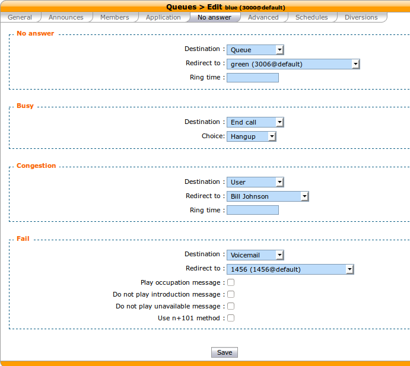

******
Queues
******

Call queues are used to distribute calls to the agents subscribed to the queue.  Queues are managed on the
:menuselection:`Services --> Call Center --> Queues` page.

.. figure:: add-queue.png
   :scale: 85%

   :menuselection:`Services --> Call Center --> Queues --> Add`

A queue can be configured with the following options:

   * Name : used as an unique id, cannot be ``general``
   * Display name : Displayed on the supervisor screen
   * On-Hold music: The music the caller will hear. The music is played when waiting and when the call is on hold.

A ring strategy defines how queue members are called when a call enters the queue.
A queue can use one of the following ring strategies:

   * Linear: for each call, call the first member, then the second, etc.
   * Least recent: call the member who has least recently hung up a call.
   * Fewest calls: call the member with the fewest completed calls.
   * Round robin memory: call the "next" member after the one who answered.
   * Random: call a member at random
   * Weight random: same as random, but taking the member penalty into account.
   * Ring all: call all members at the same time.

   .. warning::

      When editing a queue, you can't change the ring strategy to linear. This
      is due to an asterisk limitation. Unfortunately, if you want to change the
      ring strategy of a queue to linear, you'll have to delete and create a new
      queue with the right strategy.

  .. note::

     When an agent is a member of many queues. The order of call distribution
     between multiple queues is nondeterministic and cannot be configured.

Timers
======

You may control how long a call will stay in a queue using different timers:

   * Member reachabillity time out (Advanced tab): Maximum number of seconds a call will ring on an agent's phone. If a call is not answered within this time, the call will be forwareded to another agent.
   * Time before retrying a call to a member (Advanced tab) : Used once a call has reached the "Member reachability time out". The call will be put on hold for the number of seconds alloted before being redirected to another agent.
   * Ringing time (Application tab) : The total time the call will stay in the queue
   * Timeout priority (Application tab) : Determines which timeout to use before ending a call. When set to "configuration", the call will use the "Member reachability time out". When set to "dialplan", the call will use the "Ringing time".

.. figure:: queue_timers.jpg
   :scale: 85%

No Answer
=========

Call can be diverted on no answer :

* No answer : The call reach the "Ringing time" in Application tab and no agent has answered the call
* Congestion : The number of calls waiting have reach the "Maximum number of people allowed to wait:" limit of advanced tab
* Fail : No agent was available to answer the call when call entered the queue (join an empty queue condition advanced tab)  or
  the call was queued and no agents was available to answer (Remove callers if there are no agents advanced tab)

Diversions
==========

Diversions can be used to redirect calls towards another destination when a queue is very busy.
Calls are redirected using one of the two following scenarios:

.. figure:: diversions.png
    :scale: 85%

The diversion check is done only once per call, before the :ref:`preprocess subroutine <subroutine>` is
executed and before the call enters the queue.

In the following sections, a waiting call is a call that has entered the queue but has not yet been
answered by a queue member.

Estimated Wait Time Overrun
---------------------------

When this scenario is used, the administrator can set a destination for calls when the average waiting time is over the threshold.

.. note:: The average waiting time of a queue is updated only when a queue member answers a call.

If a new call arrives when there's no waiting calls, the call will always be allowed to enter the queue.

.. _queue-diversion-waitratio:

Number of Waiting Calls per Logged Agents Overrun
-------------------------------------------------

When this scenario is used, the administrator can set a destination for calls when the number of waiting
calls per logged agents is over the threshold.

The number of waiting calls includes the call for which the check is currently performed.

The number of logged agents is the sum of agent members that are currently logged and user members. An
agent only need to be logged and be a member of the queue to participate toward the count of logged agents,
whatever he is available, on call, on pause or on wrapup.

The maximum number of waiting calls per logged agents can have a fractional part.

Here are a few examples::

    Maximum number of waiting calls per logged agent: 1
    Current number of waiting calls: 2
    Current number of logged agents: 2
    Number of waiting calls per logged agent when a new call arrives: 3 / 2 = 1.5
    Call will be redirected

    Maximum number of waiting calls per logged agent: 0.5
    Number of waiting calls: 5
    Number of logged agents: 12
    Number of waiting calls per logged agent when a new call arrives: 6 / 12 = 0.5
    Call will not be redirected

If a new call arrives when there's no waiting calls, the call will always be allowed to enter the queue.
For example, in the following scenario::

    Maximum number of waiting calls per logged agent: 0.5
    Current number of waiting calls: 0
    Current number of logged agents: 1
    Number of waiting calls per logged agent when a new call arrives: 1 / 1 = 1

Even if the number of waiting calls per logged agent (1) is greater than the maximum (0.5), the call
will still be accepted since there is currently no waiting calls.
