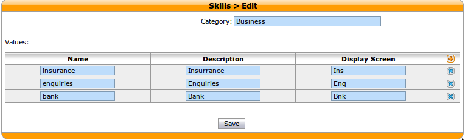
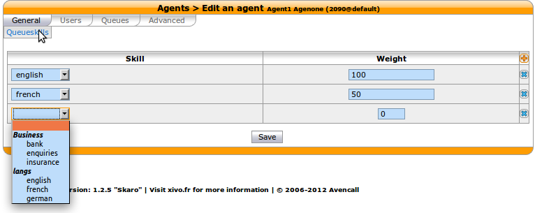
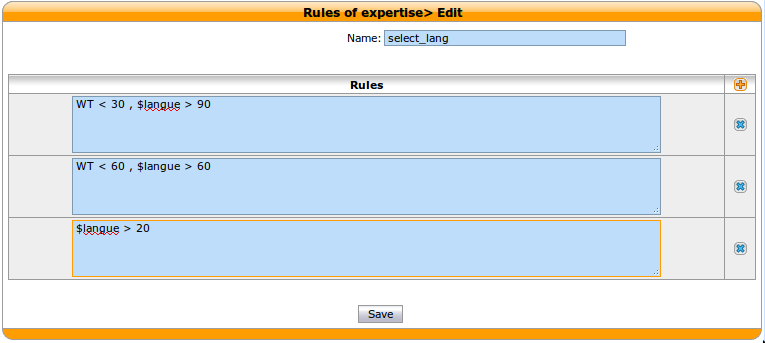
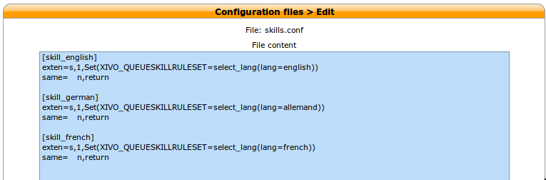
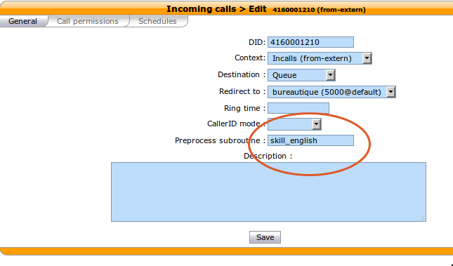

*******************
Skill Based Routing
*******************

Introduction
============

   *Skills-based routing (SBR), or Skills-based call routing, is a call-assignment strategy used in call centres to assign incoming calls
   to the most suitable agent, instead of simply choosing the next available agent.
   It is an enhancement to the Automatic Call Distributor (ACD) systems found in most call centres.
   The need for skills-based routing has arisen, as call centres have become larger and dealt with a wider variety of call types.*

   -- Wikipedia

In this respect, skills-based routing is also based on call distribution to agents through waiting queues, but one or many skills can be
assigned to each agent, and call can be distributed to the most suitable agent.

In skills-based routing, you will have to find a way to be able to tag the call for a specific skill need. This can be done for example
by entering the call distribution system using different incoming call numbers, using an IVR to let the caller do his own choice, or by requesting
to the information system database the customer profile.

.. figure:: images/sbr_introduction.png

   Skill Based Routing

Getting Started
===============

* Create the skills
* Apply the skills to the agents
* Create a skill rule sets
* Assign the skill rule sets using a configuration file
* Apply the skill rule sets to call qualification, i.e. incoming calls by using the preprocess routine field.

Skills
======

Skills are created using the menu :menuselection:`Services --> Call center --> Skills`. Each skill belongs to a category.
First create the category, and in this category create different skills. Note that the skill names can't contain upper
case letters.

   Skills Creation

Once all the skills are created you may apply them to the agents. Agents may have one or more skills from different categories.

   Apply Skills to Agents

Skill Rule Sets
===============

Once skills are created, rule sets can be defined.

Rules are the way to reach the right agent.
Rules can be composed and dynamically modified

A ruleset is a list of rules. Rules are evaluated against each queue member (agent) in order to see if it matches.
The call is distributed according to the matching rule.

Each rule has two parts:

* the first part is a dynamical condition. If its evaluation is false, the next rule is tried;
* the second part is tested against queue member's skills, to define a selection.

Operators
*********

Arithmetic and logical operators can be applied to rules :

* operand1 / operand2  (division)
* operand1 * operand2  (multiplication)
* operand1 - operand2  (substraction)
* operand1 + operand2  (addition)
* operand1 ! operand2  (is not equal)
* operand1 = operand2  (is equal)
* operand1 > operand2  (is greater than)
* operand1 < operand2  (is lesser than)
* operand1 & operand2  (both are true)
* operand1 | operand2  (at least one of them are true)

 '/' is the operator with the higher priority, and '|' the one with the lower
 priority. You can use brackets '()' to overload operator priorities.

Dynamical Part
**************

The first part is evaluated after a selection of queue members is created with
the rules from the second part, and determine if this rule can be kept or if
the selection is done with the next one.

On this part, these variables can be used:

* EWT (Estimated Waiting Time)      The waiting time estimated for the current selection of members
* WT  (Waiting time)                The time that caller has been waiting

:Example:

   | WT < 60, french = 100
   | french > 50

   If the waiting time is less than 60 seconds, select an agent speaking good french (100), otherwise select an agent with low level
   of french

Skill Part
**********

This second part is evaluated against every queue member's skills, to know
if it is selected or not.

Variables are skills names, which you can check with operators above. You can
also use meta-variables, starting with a '$', to substitute them with data set
on the Queue() call. For example, if you call Queue() with the skill rule set
argument equal to::

   select_lang(lang=german)

Then every ``$lang`` occurrence will be replaced by 'german'.

   Create Skill Rule Sets

:Examples:

::

 [tech]
 rule => WT < 60, technic & ($os > 29 & $lang > 39 | $os > 39 & $lang > 19)
 rule => WT < 120, technic & ($os > 19 & $lang > 39 | $os > 29 & $lang > 19)
 rule => WT < 3600, technic & $os > 10 & $lang > 19
 rule => technic

 [client-standard]
 rule => technic = 0 & (sympathy > 20 | linux > 10 & windows > 10)

 [client-request]
 rule => EWT < 120, technic = 0 & (sympathy > 60)
 rule => technic = 0

Apply Skill Rules
=================

Once skills, skill rules are created, they can attached to the call using a bit of dialplan.
This dialplan is stored in a configuration file you may edit using menu :menuselection:`Services --> IPBX --> Configuration Files`.

   Use Rule Set In Dialplan

In the figure above, 3 different languages are selected using three different subroutines.

.. note::

   Do not forget to issue a dialplan reload in Asterisk CLI after configuration file modification.

Each of this different selections of subroutines can be applied to the call qualifying object.
In the following example language selection is applied to incoming calls.

   Apply Rule Set to Incoming Call
   
:Example:

Configuration file for simple skill selection :

::

   [simple_skill_english]
   exten=s,1,Set(XIVO_QUEUESKILLRULESET=english_rule_set)
   same=   n,return

   [simple_skill_french]
   exten=s,1,Set(XIVO_QUEUESKILLRULESET=french_rule_set)
   same=   n,return

In this example you just need to create two simple skill rule sets, one named english_rule_set with a rule english > 90
and the other named french_rule_set

Monitoring
==========

You may monitor your waiting calls with skills using the asterisk CLI command :

::

 xivo-jylebleu*CLI> queue show services
 services has 1 calls (max unlimited) in 'ringall' strategy (0s holdtime, 2s talktime), W:0, C:1, A:10, SL:0.0% within 0s
   Members:
      Agent/2000 (Not in use) (skills: agent-1) has taken no calls yet
      Agent/2001 (Unavailable) (skills: agent-4) has taken no calls yet
   Virtual queue english:
   Virtual queue french:
      1. SIP/jyl-dev-assur-00000017 (wait: 0:05, prio: 0)
   Callers:

