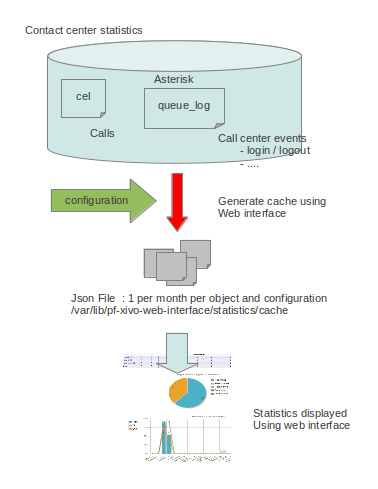
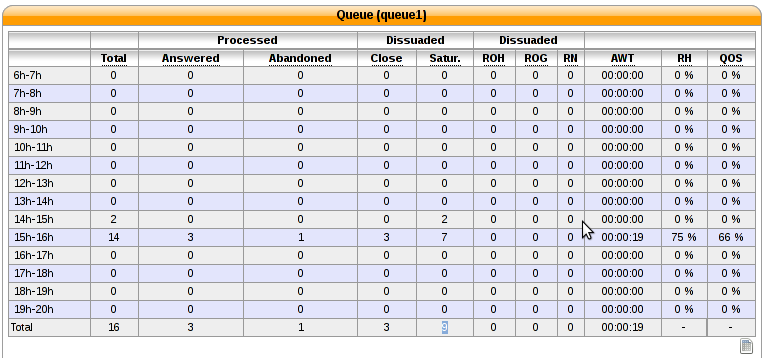
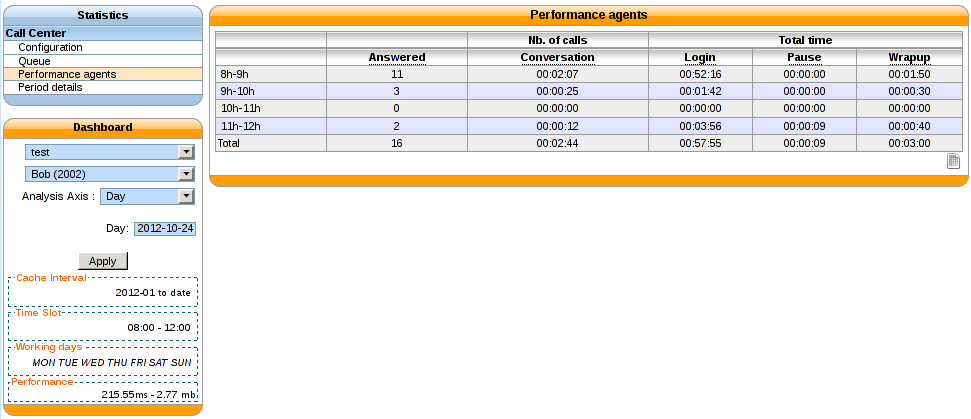

**********
Statistics
**********

Overview
========

The statistics page is used to monitor queues and agents efficiency. Statistics are generated from
the database using the *xivo-stat* command. This command will be launched automatically every night
but can also be launched manually.

.. warning::

    Call center reporting is being revamped at the moment. The old system and the new one will be
    mixed in the web-interface until the new system is in place for all counters.  This also means
    that some errors may appear due to changes in the requirements for a given page or a change in
    the configuration.

General Architecture
==================================

.. figure:: images/archi.png
   :scale: 60%
   :alt: Statistics Architecture

   Statistics Architecture

#. The *queue_log* table of the *asterisk* database is filled by events from Asterisk and by custom dialplan events
#. *xivo-stat fill_db* is then used to read data from the *queue_log* table and generate the tables *stat_call_on_queue* and *stat_queue_periodic*
#. The web interface generate tables and graphics from the *stat_call_on_queue* and *stat_queue_periodic* tables depending on the selected configuration

Cache tables
------------

stat_call_on_queue
^^^^^^^^^^^^^^^^^^

This table is used to store each call individually.  Each call received on a queue generates a
single entry in this table containing time related fields and a foreign key to the agent who
answered the call and another on the queue on which the call was received.

It also contains the status of the call ie. answered, abandoned, full, etc.

stat_queue_periodic
^^^^^^^^^^^^^^^^^^^

This table contains counters on each queue for each given period. The granularity at the time of
this writing is an hour and is not configurable.  This table is then used to compute statistics
for a given range of hours, days, week, month or year.

stat_agent
^^^^^^^^^^

This table is used to match agents to an id that is different from the id in the agent configuration
table. This is necessary to avoid loosing statistics on a deleted agent. This also means that if an
agent changes number ie. Agent/1001 to Agent/1202, the supervisor will have to take this information
into account when viewing the statistics. Affecting an old number to a another agent also means that
the supervisor will have to ignore entries for this given agent for the period before the number
assignment to the new agent.

stat_queue
^^^^^^^^^^

This table is used to store queues in a table that is different from the queue configuration table.
This is necessary to avoid losing statistics on a deleted queue. Renaming a queue is also not
handled at this time.

General Architecture (The old way)
==================================

   Statistics Architecture

Configuration
=============

In order to be able to display call center statistics you have first to create one or more configuration.

.. figure:: images/Statistic_configuration.png
   :scale: 90%
   :alt: Statistics Configuration

   Statistics Configuration

The configuration is used to generate reports from the cache. The cache is generated independently
from the configuration so adding a new configuration does not require a new cache generation.

+------------------+---------------------------------+---------------------------------------------------------------------------+
| Field            | Values                          | Description                                                               |
|                  |                                 |                                                                           |
+==================+=================================+===========================================================================+
|                  |                                 |                                                                           |
+------------------+---------------------------------+---------------------------------------------------------------------------+
| name             | string                          | Any name useful to remember what the configuration is used to             |
+------------------+---------------------------------+---------------------------------------------------------------------------+
| interval         | enum [0-999] [day, week, month] | This parameter is used as a default when you display statistics.          |
|                  |                                 | If -1 day, default view displays yesterday statistics                     |
+------------------+---------------------------------+---------------------------------------------------------------------------+
| show on page     |                                 | Display on the summary page                                               |
+------------------+---------------------------------+---------------------------------------------------------------------------+
| timezone         | America/Montreal                | Time difference to apply when users are not in the same time zone as XIVO |
+------------------+---------------------------------+---------------------------------------------------------------------------+
| **Period cache** |                                 |                                                                           |
+------------------+---------------------------------+---------------------------------------------------------------------------+
| start            | YYYY-MM                         | Cache start date                                                          |
+------------------+---------------------------------+---------------------------------------------------------------------------+
| Cache start date | hh:mm                           | Cache end date if left to 0 the end of cache is the server current date   |
+------------------+---------------------------------+---------------------------------------------------------------------------+
| **Working Hour** |                                 |                                                                           |
+------------------+---------------------------------+---------------------------------------------------------------------------+
| start            | hh:mm                           | beginning of work, data of of working hours will not be in cache          |
+------------------+---------------------------------+---------------------------------------------------------------------------+
| end              | hh:mm                           | End of working hours                                                      |
+------------------+---------------------------------+---------------------------------------------------------------------------+
| **Periods**      |                                 |                                                                           |
+------------------+---------------------------------+---------------------------------------------------------------------------+
| Period 1         | Ex : 0-20 ( seconds )           | Used for period statistics, as call answered within Period X etc ...      |
+------------------+---------------------------------+---------------------------------------------------------------------------+
| Period n         | Ex : 0-20 ( seconds )           | Used for period statistics, as call answered within Period X etc ...      |
+------------------+---------------------------------+---------------------------------------------------------------------------+

.. warning:: Statistics are computed on full hours only. If work hours are from 8h30 to 16h15,
    working hours should be set from 8h to 17h.

How to generate the cache
-------------------------

The new way
^^^^^^^^^^^

.. warning:: This cache include queue statistics and agents total conversation time

To get the reporting to work, the cache must be generated. The script to generate the cache is *xivo-stat fill_db*.
When *xivo-stat fill_db* is run, all stats are computed from the last fill_db to the end of the previous hour.

.. warning:: *xivo-stat fill_db* can be a long operation when used for the first time or after a *xivo-stat clean_db*.

.. warning:: *xivo-stat fill_db* will only computer the statistic up to the last complete hour.
    ie. at 12h47, statistics will be computed from the last *xivo-stat fill_db* to 11h59 59s

The old way
^^^^^^^^^^^

.. warning:: Includes agents counter except agent total conversation time

In order to be able to display call center statistics you have first to create one or more configuration.

.. figure:: images/Statistic_configuration.png
   :scale: 90%
   :alt: Statistics Configuration

   Statistics Configuration

The configuration is used to generate reports from the cache. The cache is generated independently
from the configuration so adding a new configuration does not require a new cache generation.

Cleaning the cache
------------------

If for some reason the cache generation fails and the cache becomes unusable, the administrator can clean the cache
using *xivo_stat clean_db*.

Queue statistics
================

Queue statistics can be viewed in :menuselection:`Services --> Statistics --> Queue`.

Counters
--------

* Total: Number of received calls
* Answered: Calls answered by an agent
* Abandoned: The caller hanged up while waiting for an answer
* Close: Calls received when the queue was closed
* No answer (NA): The call reached the ring timeout delay
* Busy: The queue was already full when the call was received
* Join empty (JE): There was no agent available when the call was received
* Leave empty (LE): There is no agent to take the call anymore
* Average waiting time (AWT): The average wait time of call that have waited
* Home rated (HR): The ratio of answered calls over received calls
* Quality of service (QoS): Percentage of calls answered in less than x seconds over the number of answered calls, where x is defined in the configuration

Agent performance
=================

Agent performance statistics can be viewed in :menuselection:`Services --> Statistics --> Queue`.

Counters
--------

* Answered: The number of answered calls for this agent.
* Conversation: Time spent in conversation for calls answered during a given period.
