**********
Statistics
**********

Overview
========

The statistics page is used to monitor the efficiency of queues and agents. Statistics
are automatically generated every six hours. They can also be generated manually.

.. note::

 The contact center statistics do not apply to switchboard queues. See :ref:`switchboard`
 for more details.

.. note:: xivo-purge-db can impact on statistics. See :ref:`purge_logs` for more details.

Configuration
=============

In order to display call center statistics, you must create at least one configuration profile.

.. figure:: images/Statistic_configuration.png
   :scale: 90%
   :alt: Statistics Configuration

   Statistics Configuration

The configuration profile is used to generate reports from the cache. The cache is generated independently
from the configuration so adding a new configuration does not require a new cache generation.

Configuration options
---------------------

+----------------------+---------------------------------+-------------------------------------------------------------------------------+
| Field                | Values                          | Description                                                                   |
|                      |                                 |                                                                               |
+======================+=================================+===============================================================================+
|                      |                                 |                                                                               |
+----------------------+---------------------------------+-------------------------------------------------------------------------------+
| name                 | string                          | Configuration name, useful for remembering what the configuration is used for |
+----------------------+---------------------------------+-------------------------------------------------------------------------------+
| interval             | enum [0-999] [day, week, month] | Default time interval used when displaying statistics.                        |
|                      |                                 | Examples:                                                                     |
|                      |                                 | "-1 day": show statistics for yesterday                                       |
|                      |                                 | "-3 weeks": show statistics for the last 3 weeks                              |
+----------------------+---------------------------------+-------------------------------------------------------------------------------+
| show on summary page |                                 | Display this configuration on the summary page                                |
+----------------------+---------------------------------+-------------------------------------------------------------------------------+
| timezone             | America/Montreal                | Your time zone                                                                |
+----------------------+---------------------------------+-------------------------------------------------------------------------------+
|                      |                                 |                                                                               |
+----------------------+---------------------------------+-------------------------------------------------------------------------------+
| **Period cache**     |                                 | Maximum and minimum dates that can be used for displaying statistics          |
+----------------------+---------------------------------+-------------------------------------------------------------------------------+
| start                | YYYY-MM                         | Start date                                                                    |
+----------------------+---------------------------------+-------------------------------------------------------------------------------+
| end                  | YYYY-MM                         | End date. If left to 0, use the servers' current date                         |
+----------------------+---------------------------------+-------------------------------------------------------------------------------+
|                      |                                 |                                                                               |
+----------------------+---------------------------------+-------------------------------------------------------------------------------+
| **Working Hours**    |                                 | Work hours for agents                                                         |
+----------------------+---------------------------------+-------------------------------------------------------------------------------+
| start                | hh:mm                           | Beginning of working hours.                                                   |
+----------------------+---------------------------------+-------------------------------------------------------------------------------+
| end                  | hh:mm                           | End of working hours                                                          |
+----------------------+---------------------------------+-------------------------------------------------------------------------------+
|                      |                                 |                                                                               |
+----------------------+---------------------------------+-------------------------------------------------------------------------------+
| **Periods**          |                                 | Number of calls answered for a time period                                    |
+----------------------+---------------------------------+-------------------------------------------------------------------------------+
| Period 1             | number of seconds (Example: 20) | Show number of calls answered within 20 seconds in column "P1"                |
+----------------------+---------------------------------+-------------------------------------------------------------------------------+
| Period n             | number of seconds (Example: 20) | Show number of calls answered within 20 seconds in column "Pn"                |
+----------------------+---------------------------------+-------------------------------------------------------------------------------+

.. note:: Calls outside of working hours will not be in the cache.
    e.g. if working hours are from 8:00 AM to 16:00 PM, a call at 7:55 AM will not show up in the reports.

.. note:: Statistics are computed on the hour. e.g. If work hours are from 8:30 to 16:15,
    working hours should be set from 8:00 to 17:00.

.. note:: Period includes both bounds, if the same number is used for the higher bound and the lower bound of next period,
   some calls will be counted twice. i.e period 1 : 0-30 period 2 : 31-60 period 3 : 61

How to generate the cache
-------------------------

The cache must be generated before using reports. By default, the cache is
automatically generated every six hours.

However, you can safely generate it manually. The script to generate the cache is *xivo-stat fill_db*.
When this script is run, statistics will be regenerated for the last 8 hours starting from the previous hour.
e.g. If you run xivo-stat on 2012-08-04 11:47:00, statistics will be regenerated from 2012-08-04 03:00:00 to 2012-08-04 11:47:00

.. note:: *xivo-stat fill_db* can be a long operation when used for the first time or after a *xivo-stat clean_db*

.. warning:: The current events have an end date of the launch date of the script xivo-stat as the end date.

Clearing the cache
------------------

If for some reason the cache generation fails or the cache becomes unusable,
the administrator can safely clean the cache using *xivo-stat clean_db* and then
regenerate it. This operation will only clear the cache and does *not* erase any other data.

Queue statistics
================

Queue statistics can be viewed in :menuselection:`Services --> Statistics --> Queue`.

The first table displays a list of queues with all the counters for the period choosen from the Dashboard panel

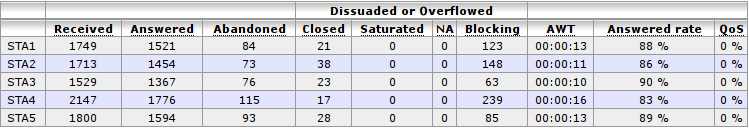

By clicking on a queue name you may display detailed queue statistics

.. figure:: images/statistic_queue.png
   :scale: 85%
   :alt: Queue statistic

Statistics can be displayed :

By week
-------

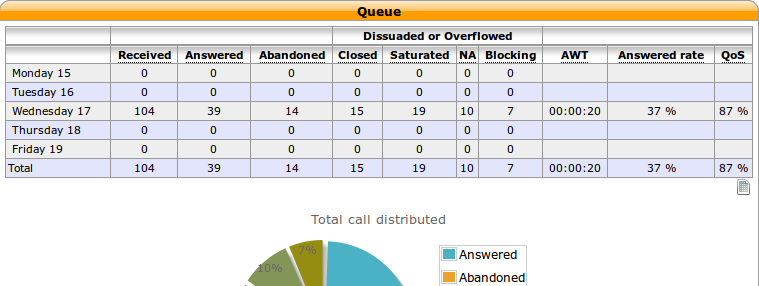

By month
--------

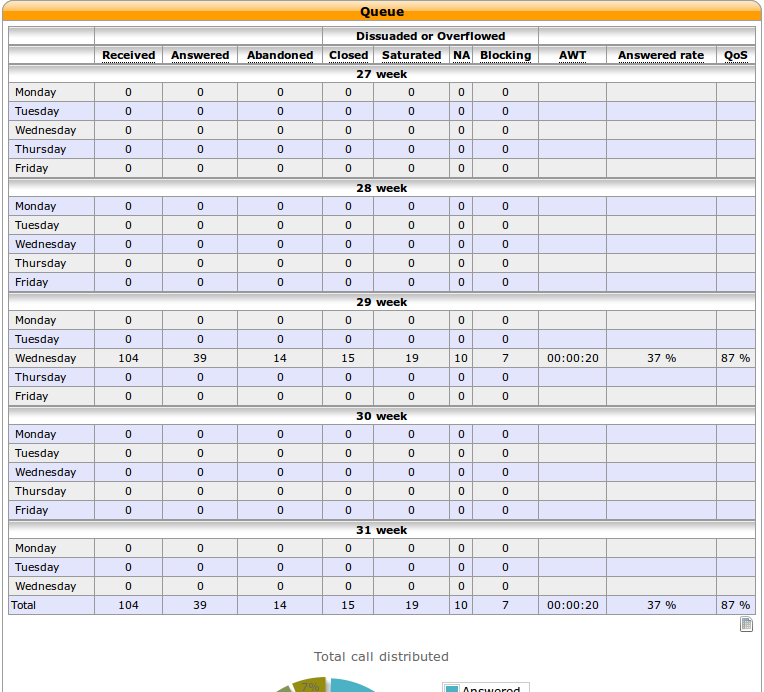

By year
-------

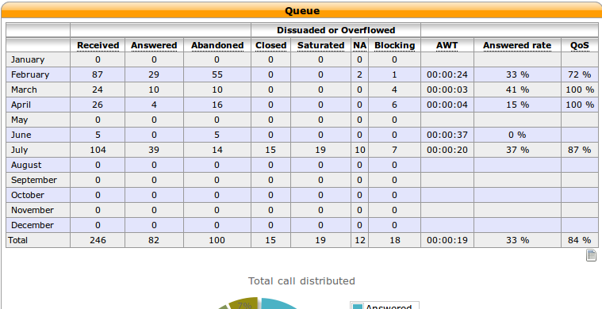

Counters
--------

* Received: Total number of received calls
* Answered: Calls answered by an agent
* Abandoned: Calls that were hung up while waiting for an answer
* Dissuaded or Overflowed:

  * Closed: Calls received when the queue was closed
  * No answer (NA): Calls that reached the ring timeout delay
  * Satured: Calls received when the queue was already full ("Maximum number of people allowed to wait:" limit of advanced tab)
    or when one of the diversion parameters were reached
  * Blocking : Calls received when no agents were available or when there were no agents to take the call, join an empty queue condition
    or remove callers if there are no agents condition is reached (advanced queue parameter tab).

* Average waiting time (AWT): The average waiting time of call on wait
* Answered rate (HR): The ratio of answered calls over (received calls - closed calls)
* Quality of service (QoS): Percentage of calls answered in less than x seconds
  over the number of answered calls, where x is defined in the configuration

Agent performance
=================

Agent performance statistics can be viewed in
:menuselection:`Services --> Statistics --> Performance agents`.

.. figure:: images/statistic_agent.png
    :alt: Performance Agents statistic

.. note:: The agent performance counters do not take into account transfer
          between agents: if agent A processes a call and transfers it to agent
          B, only the counters of agent A will be updated. Ignoring any
          info after the call transfer.

Counters
--------

* Answered: Number of calls answered by the agent
* Conversation: Total time spent for calls answered during a given period
* Login: Total login time of an agent.
* Wrapup: Total time spent in wrapup by an agent.
* Pause: Total pause time of an agent

.. warning:: Data generated before XiVO 12.19 might have erroneous results for the Login time counter
.. note:: The Pause time counter only supports **PAUSEALL** and **UNPAUSEALL** command from cticlient
.. note:: Wrapup time events were added to XiVO in version 12.21

Agent summary
-------------

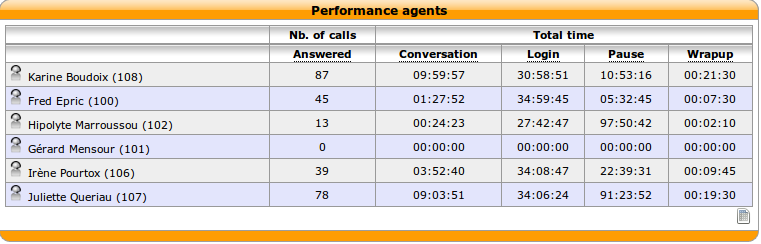

Agent per day
-------------

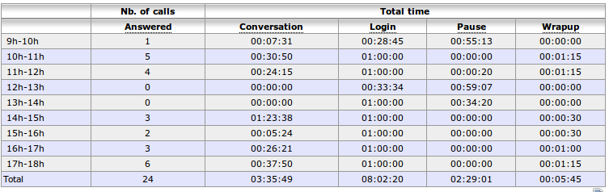

Agent per week
--------------

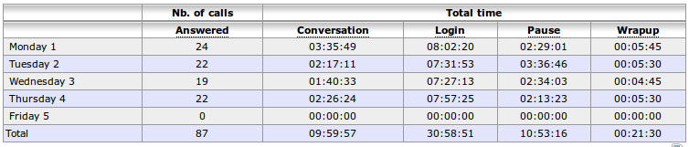

Agent per month
---------------

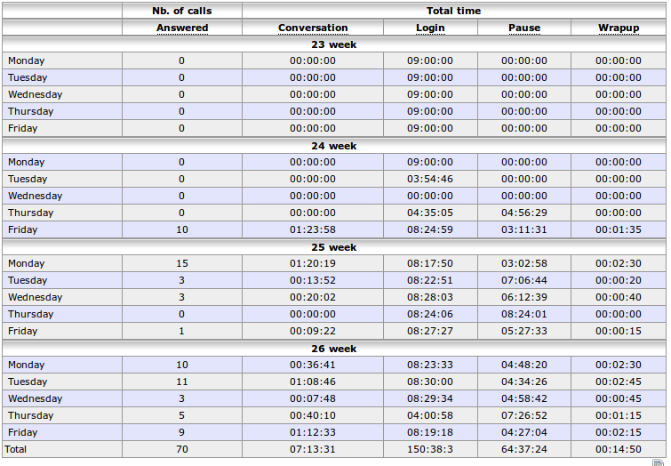

Agent per year
--------------

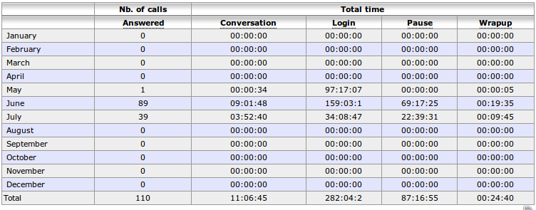

Period details
==============
Display by period defined in configuration, i.e. between 0 and 10s, 10s and 30s etc ...
the number of handled calls and the number of abandonned calls

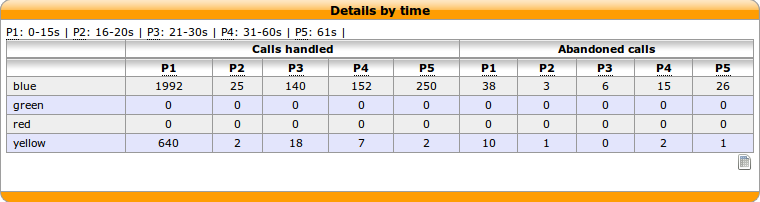

You may click on a queue name to get more information for this queue

Period details by day
---------------------

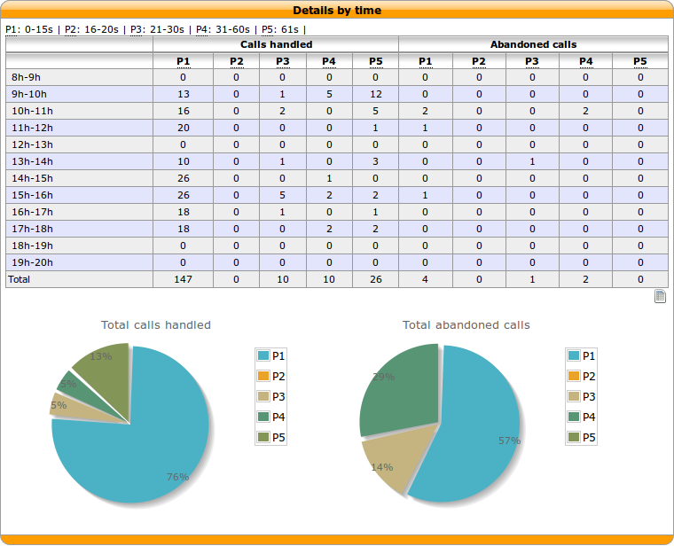

Period details by week
----------------------

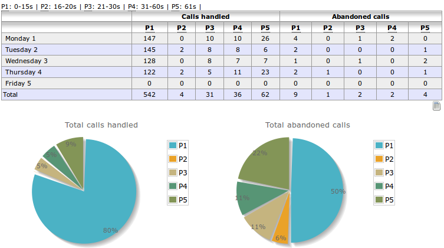

Period details by month
-----------------------

.. figure:: images/statistic_period_details_month.png
    :alt: Queue period details for a month

Period details by year
----------------------

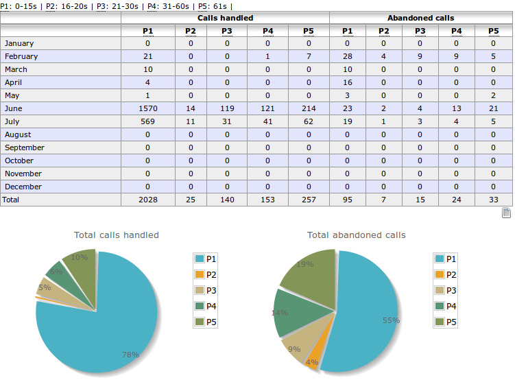
