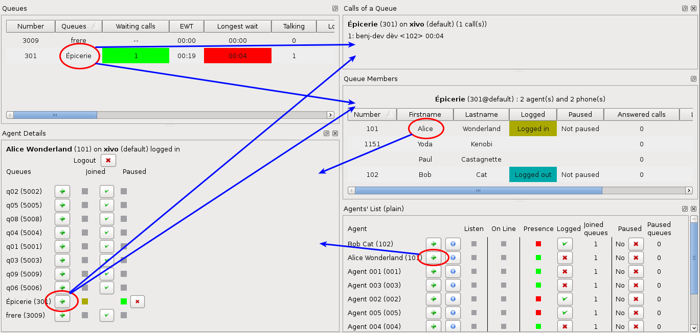
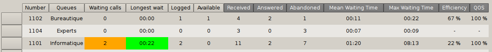
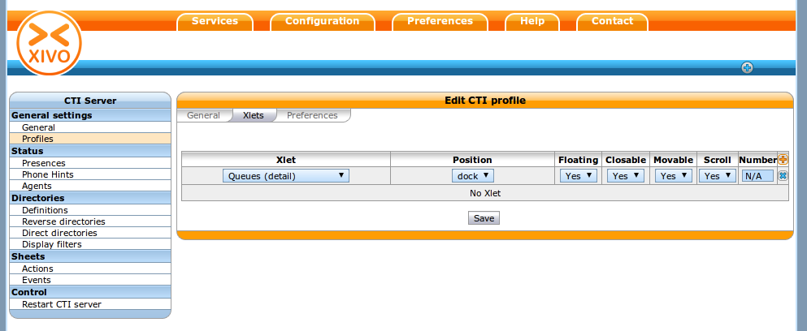
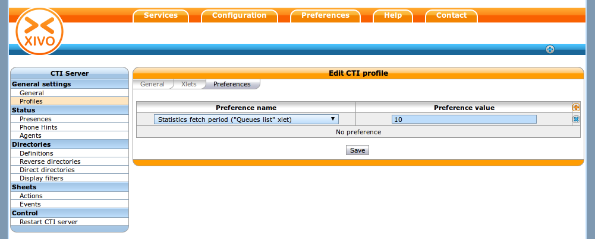
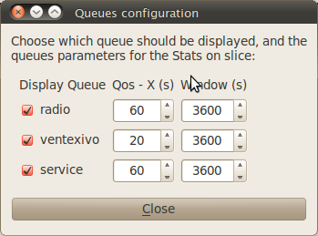
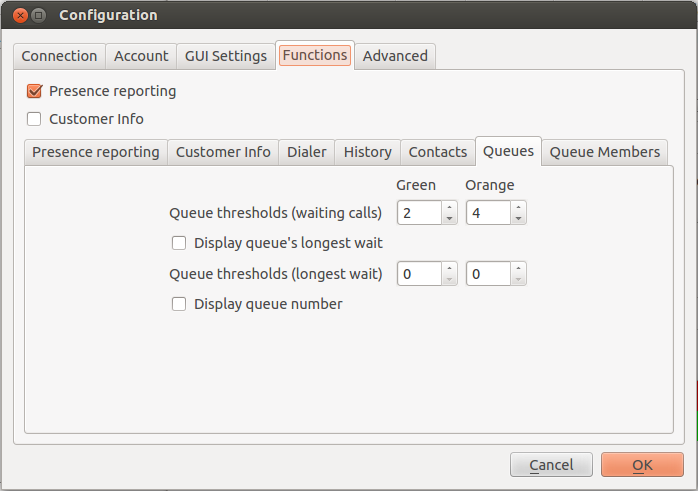
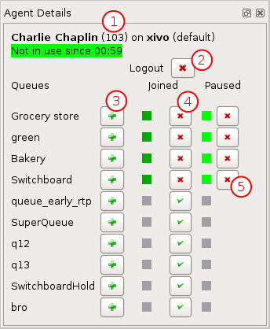

***********
Supervision
***********

Introduction
============

Allows a contact center supervisor to monitor contact center activities such as:

* Monitoring real time information from call queues
* Agent activities per call queues
* Agent detailed activities

XiVO client as a Supervision Platform
=====================================

Configuration
-------------

A supervisor profile defined in :menuselection:`Service --> CTI Server -->
Profiles` menu usually contains the following Xlets :

* Identity
* Queues
* Queue members
* Queues (entries detail)
* Agents (list)
* Agents (detail)

:Note: You may also see the :ref:`agent_dashboard`

Supervision Panel
-----------------

* Clicking on a queue's name in the queue list will display the agent list in the xlet `Queue Members` and show waiting calls in the `Calls of a Queue` xlet.

* Clicking on an agent's name in the agent list will display information on the agent in the `Agent Details` xlet

* Clicking on the `+` icon in the `Agent Details` xlet will display information about the selected queue in the `Calls of a Queue` and `Queue Members` xlets.

Queue List
^^^^^^^^^^
**General information**

The queue list is a dashboard displaying queue statistics and real-time counters for each queue configured on the Wazo.

**Real-time Columns**

The data of following columns display real-time information.

Queues
   queue name and number if configured to be displayed

Waiting calls
   The number of calls currently waiting for an agent in this queue. The background color
   can change depending of the configured thresholds

EWT
   Estimated waiting time

Longest wait
   The longest waiting time for currently waiting calls. The background color can change
   depending of the configured thresholds

Talking
   The number of agents currently in conversation in the queue.
   This column is set to 0 when the queue has just been created and no members have been added.

Logged
   The number of logged agents in the queue.
   This column is set to "N/A" when the queue has just been created and no members have been added.

Available
   The number of available agents ready to take a call in the queue.
   This column is set to N/A when the queue has just been created and no members have been added.

**Last Period Columns**

The data of following columns are based on statistics fetched from a fixed-width window of time,
e.g. the last 60 minutes or the last 10 minutes. See below to configure the width of the window for
each queue.

Received
   The number of calls received in this queue during the configured statistical window

Answered
   The number of calls answered in this queue during the configured statistical window

Abandoned
   The number of calls abandoned in this queue during the configured statistical window

Mean waiting time
   The mean wait time in the statistical time window, in mm:ss
   If no calls are received, "-" is displayed

Max waiting time
   The longest wait time in the statistical time window, in mm:ss
   If no calls are received, "-" is displayed

Efficiency
   Answered calls over received calls during the configured statistical window
   (unanswered calls that are still waiting are not taken into account).
   If no calls are received, "-" is displayed

QOS
   Percentage of calls taken within X seconds over answered calls during the configured statistical window.
   If no calls are received, "-" is displayed

**Counter availability**

When the XiVO client is started, "na" is diplayed for counters that have not been initialized.

When the XiVO client is restarted, the counters are always displayed and calculated as if
the application was not restarted. When the server is restarted, counters are reinitialized.

**Enabling the xlet**

The xlet can be added to any CTI profile from the web interface.

**Configuration**

Some values can be configured for the xlet. The statistic fetch timer can be set in the CTI profile preferences.
This option is expressed in seconds and the default is 30 seconds.

The statistical period can be configured through the XiVO client once logged in by right-clicking on the Queue's name in the `Queues` xlet.
For each queue, you can configure the following information:

 * Qos:  maximum wait time for a call, in seconds.
 * Window: period of time used for accumulating statistics, in seconds.

The data used to compute statistics on the Wazo server is only kept for a maximum of 3 hours.
The window period cannot be configured to go beyond this limit.

Display options can also be set on the client side. A threshold can be configured to change the color of a column using the following parameters:

 * Queue thresholds (waiting calls): number of waiting calls in the queue.
 * Display queue's longest wait: Add a column displaying the number of seconds the longest call has waited.
 * Queue thresholds (longest wait): number of seconds for the longest waiting call in the queue.
 * Display queue number: Add a column displaying the queue's number.

**Monitoring queues on high dimension screens**

You may want to display the queue list on one big screen, visible by multiple
people. However, the default font will not be large enough, so the information
will not be readable.

You can change the font size of this Xlet by giving a configuration file when
launching the XiVO Client::

   > xivoclient -stylesheet big_fonts.qss   # Windows and Mac
   $ xivoclient -- -stylesheet big_fonts.qss   # GNU/Linux

The :file:`big_fonts.qss` file should contain::

   QueuesView {font-size: 40px;}
   QueuesView QHeaderView {font-size: 40px;}

Units of size that can be used are described on the `Qt documentation`_.

.. _Qt documentation: http://doc.qt.nokia.com/latest/stylesheet-reference.html#length.

Agent List
^^^^^^^^^^

**General information**

The queue list is a dashboard displaying each agent configured on the Wazo.

.. figure:: images/agent_list.png
   :scale: 80%

**Columns**

Number
   The agent's number

First name & Last name
   The agent's first name and last name

Listen
   A *clickable cell* to listen to the agent's current call.

   Clicking on the cell will make your phone ring. When you'll answer, you'll hear
   the conversation the agent is having.

   You'll then be able to press the following digits on your phone to switch between
   the different "listen" modes:

   * 4 - spy mode (default). No one hears you.
   * 5 - whisper mode. Only the agent hears you.
   * 6 - barge mode. Both the agent and the person he's talking to hear you.

Status since
   Shows the agent's status and the time spent in this status. An agent can have three statuses:

   * *Not in use* when he is ready to answer an ACD call
   * *Out of queue* when he called or answered a call not from the queue
   * *In use* when he is either on call from a queue, on pause or on wrapup

Logged
   A *clickable cell* to log or unlog the agent

Joined queues
   The number of queues the agent will be receiving calls from

Paused
   A *clickable cell* to pause or unpause the agent

Paused queues
   The number of queues in which the agent is paused

Agent Details
^^^^^^^^^^^^^

**General information**

Display advanced informations of an agent and enable to login/logoff, add/remove to a queue, and pause/unpause.

   Agent Details

1. This is the status information of agent
2. Button to login/logoff agent
3. Supervision button of the Xlet "Calls of a queue"
4. Add/Remove agent for given queue
5. Pause/Unpause button for given queue

Queue members
^^^^^^^^^^^^^

The queue members lists which agents or phones will receive calls from the
selected queue and some of their attributes.

.. figure:: images/queue_members.png

**Columns**

Number
    The agent number or the phone number of the queue member.

Firstname and Lastname
    First name and last name of the agent or the user to which the phone belongs.

Logged
    Whether the agent is logged or not. Blank for a phone.

Paused
    Whether the agent is paused or not. Blank for a phone.

Answered calls
    Number of calls answered by the member since last login (for an agent), or restart
    or configuration reload.

Last call
    Hangup time of the last answered calls.

Penalty
    Penalty of the queue member.

Link XiVO Client presence to agent presence
===========================================

You can configure Wazo to have the following scenario:

* The agent person leaves temporarily his office (lunch, break, ...)
* He sets his presence in the XiVO Client to the according state
* The agent will be automatically set in pause and his phone will not ring from
  queues
* He comes back to his office and set his presence to 'Available'
* The pause will be automatically cancelled

You can :ref:`configure the presence states <presence-actions>` of CTI profiles
and attach ``Actions`` to them, such as `Set in pause` or `Enable DND`.

You can then attach an action `Set in pause` for multiple presence states and
attach an action `Cancel the pause` for the presence state `Available`.

For now, the actions attached to the mandatory presence `Disconnected` will not
be taken into account.
