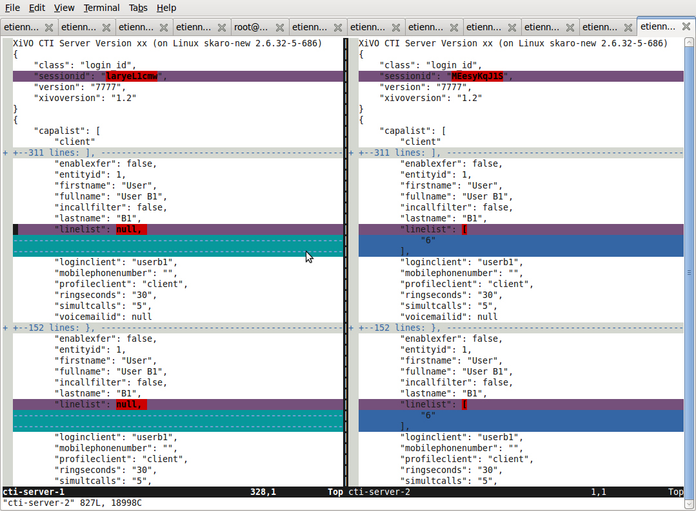

*********
CTI Proxy
*********

Here's how to run the various CTI client-server development/debugging
tools. These tools can be found on GitHub, in the `XiVO project`_.

.. _XiVO project: https://github.com/xivo-pbx/xivo-tools

You can get the scripts by using Git::

   $ git clone https://github.com/xivo-pbx/xivo-tools.git

General Information
===================

Both the ctispy, ctisave and ctistat tools work in a similar way. They both are
proxies that need to be inserted between the CTI client and the CTI server
message flow.

To do this, you first start the given tool on your development machine, giving
it the CTI server hostname as the first argument. You then configure your CTI
client to connect to the tool on port 50030 (notice the trailing 0). The tool
should then accept the connection from the client, and once this is done, will
make a connection to the server, thereby being able to process all the
information sent between the client and the server.

In the following examples, we suppose that the CTI server is located on the host
named xivo-new.

Tools
=====

ctispy
------

``ctispy`` can be used to see the message flow between the client and the server in
"real-time".

The simplest invocation is::

   $ cti-proxy/ctispy xivo-new

You can pretty-print the messages if you want by using the ``--pretty-print``
option::

   $ cti-proxy/ctispy xivo-new --pretty-print

By default, each message is displayed separately even though more than one
message can be in a single TCP packet. You can also use the ``--raw`` option if you
want to see the raw traffic between the client and the server::

   $ cti-proxy/ctispy xivo-new --raw

Note that when using the ``--raw`` option, some other option doesn't work because
the messages are not decoded/analyzed.

If you want to remove some fields from the messages, you can use the ``--strip``
option::

   $ cti-proxy/ctispy xivo-new --strip timenow --strip commandid --strip replyid

If you want to see only messages matching a certain key and value, use the
``--include`` option::

   $ cti-proxy/ctispy xivo-new --include class=getlist

Finally, you can ignore all the messages from the client or the server by using
the ``--no-client`` or ``--no-server`` option respectively.

By default, ctispy will exit after the connection with the client is closed. You
can bypass this behavior with the ``--loop`` option, that will make the CTI proxy
continue, whether the client is connected or not.

ctisave
-------

``ctisave`` save the messages from the client and the server in two separate
files. This is useful to do more careful post-analysis.

The simplest invocation is::

   $ cti-proxy/ctisave xivo-new /tmp/cti-client /tmp/cti-server

To do comparison, it's often useful to strip some fields::

   $ cti-proxy/ctisave xivo-new /tmp/cti-client /tmp/cti-server --strip timenow
   --strip commandid --strip replyid

One useful thing to do with files generated from different ctisave invocation is
to compare them with a tool like vimdiff, for example:

ctistat
-------

``ctistat`` display various statistic about a CTI "session" when it ends.

The simplest invocation is::

   $ cti-proxy/ctistat xivo-new
