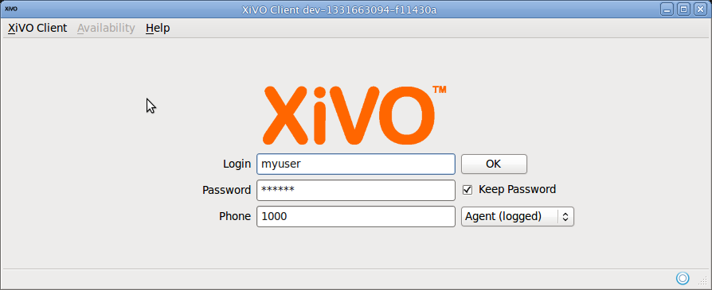
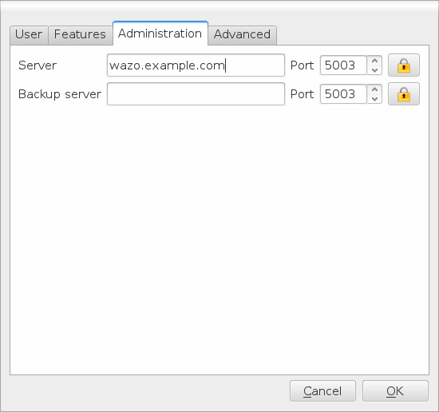
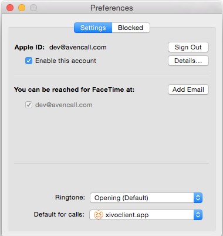
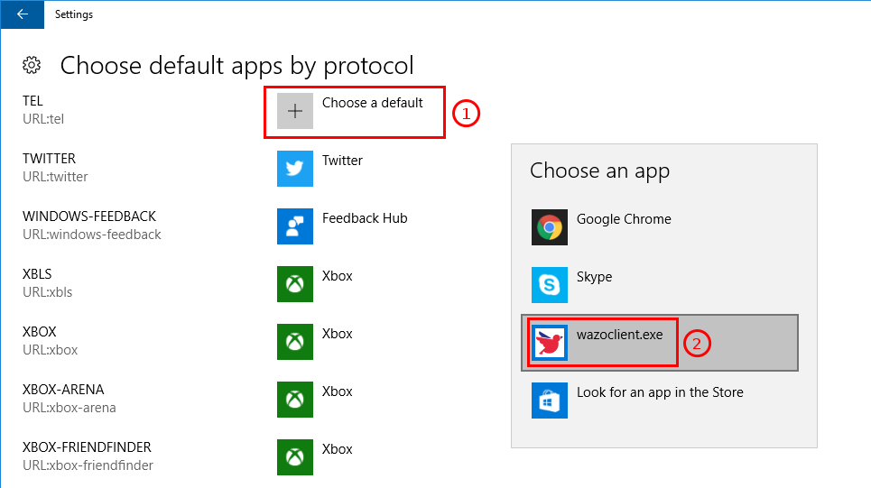
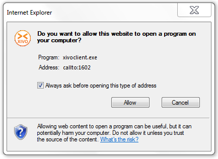
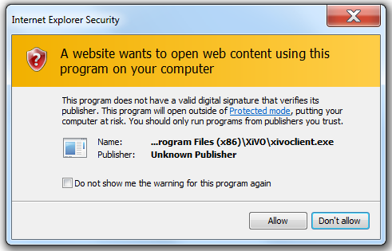

.. index:: single:XiVO Client

***********
XiVO Client
***********

This section describes the XiVO Client.

Getting the XiVO client
=======================

Binaries of the XiVO Client are available on our mirror. (`latest version`_) (`all versions`_)

.. _all versions: http://mirror.xivo.io/iso/archives
.. _latest version: http://mirror.xivo.io/iso/xivo-current

.. warning::

   The installed version of the XiVO Client must match the XiVO server's version installation. With
   our current architecture, there is no way to guarantee that the XiVO server will be
   retro-compatible with older versions of the XiVO Client. Non-matching XiVO server and XiVO
   Clients versions might lead to unexpected behaviour.

Choose the version you want and in the right directory, get :

* the ``.exe`` file for Windows
* the ``.deb`` file for Ubuntu or Debian (i386 or amd64, depending on your computer)
* the ``.dmg`` file for Mac OS

For Windows, double-click on the file and follow the instructions. You can also install it silently::

   xivoclient-14.XX-x86.exe /S

For Ubuntu/Debian, double-click on the file or execute the following command::

   $ gdebi xivoclient-*.deb

For Mac OS, double-click on the file and drag-and-drop the inner file on the
Application entry of the Finder.

The XiVO Client should then be available in the applications menu of each platform.

.. index:: Xlets

Connection to the server
========================

To connect to the server using the XiVO client you need a user name, a password and the server's
address. Optionally, it is possible to login an agent while connecting to the server.

.. _xlet-list:

Xlets
=====

Xlets are features of the XiVO Client. It is the contraction of XiVO applets.

.. toctree::
   :maxdepth: 1

   Conference xlet <xlets/conference>
   Contact xlet <xlets/contact>
   Directory xlet <xlets/directory>
   Fax xlet <xlets/fax>
   History xlet <xlets/history>
   Identity xlet <xlets/identity>
   Local directory xlet <xlets/localdir>
   People xlet <xlets/people>
   Remote Directory xlet <xlets/remote_directory>
   Service xlet <xlets/service>

Configuration
=============

The XiVO Client configuration options can be accessed under :menuselection:`XiVO Client --> Configure`.

Connection Configuration
------------------------

This page allows the user to set his network information to connect to the xivo-ctid server.

* `Server` is the IP address of the server.
* `Backup server` is the IP address of the backup server.
* `Port` is the port on which xivo-ctid is listening for connections. (default: 5003)

If an encrypted connection between the client and server is required, click on the lock icon and
change the port value to 5013. The server needs to be configured to :ref:`accept encrypted
connection <ctid-encryption>`.

Handling callto: and tel: URLs
==============================

The XiVO Client can handle telephone number links that appear in web pages. The client will
automatically dial the number when you click on a link.

.. note:: You must already be logged in for automatic dialing to work, otherwise the client will
           simply start up and wait for you to log in.

.. warning:: The option in the XiVO Client :menuselection:`GUI Options --> Allow multiple instances
             of XiVO Client` must be disabled, else you will launch one new XiVO Client with every click.

Mac OS
------

``callto:`` links will work out-of-the-box in Safari and other web browsers
after installing the client.

``tel:`` links will open FaceTime after installing the client. To make the
XiVO Client the default application to open ``tel:`` URLs in Safari.

1. Open the FaceTime application
2. Connect using your apple account
3. Open the FaceTime preferences
4. Change the *Default for calls* entry to *xivoclient.app*

.. note:: The ``tel:`` URL works out-of-the-box in versions of mac osx before 10.10.

Windows
-------

XiVO Client is associated with ``callto:`` and ``tel:`` upon installation. Installing other
applications afterward could end up overriding these associations. Starting with Windows Vista, it is possible
to configure these associations via the Default Programs. Users can access Default Programs from Control
Panel or directly from the Start menu.

The following popups might appear when you open a ``callto:`` or ``tel:`` link for the first time in
Internet Explorer:

Simply click on *allow* to dial the number using the XiVO Client.

.. note:: If you do not want these warnings to appear each time, do not forget to check/uncheck the
          checkbox at the bottom of the popups.

Ubuntu
------

Currently, ``callto:`` or ``tel:`` links are only supported in Firefox. There is no configuration
needed.

GNU/Linux Debian
----------------

Currently, ``callto:`` or ``tel:`` links are only supported in Firefox. If the XiVO Client is not
listed in the proposition when you open the link, browse your files to find
:file:`/usr/bin/xivoclient`.

Manual association in Firefox
-----------------------------

If, for some reason, Firefox does not recognize ``callto:`` or ``tel:`` URIs you can manually
associate them to the XiVO Client using the following steps:

1. Type ``about:config`` in the URL bar
2. Click the *I'll be careful, I promise !* button to close the warning
3. Right-click anywhere in the list and select *New -> Boolean*
4. Enter ``network.protocol-handler.external.callto`` as preference name
5. Select ``false`` as value
6. Repeat steps 3 to 6, but replace ``callto`` by ``tel`` at step 4

The next time that you click on a telephone link, Firefox will ask you to choose an application. You
will then be able to choose the XiVO client for handling telephone numbers.
