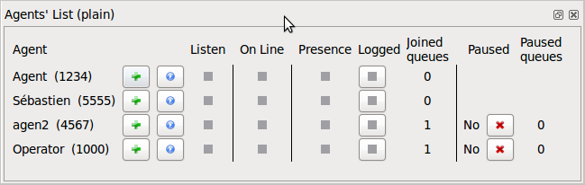

**********
Agent List
**********

Overview
========

The agent list xlet allow the supervisor to get an up to date status for each agents.

Usage
=====

The supervisor can use buttons to do some actions on agents:

* The `+` sign focus other xlets on this agent
* The "play" button will start listening the agent
* The login button will login or logoff an agent
* The pause button will pause or un-pause an agent

Some columns shows different statuses:

* `Listen` shows if the agent is being listened
* `On Line` shows if the agent is on a call
* `Presence` shows if the agent is logged

Listening
=========

When the supervisor is listening to an agent, the supervisor will hear the agent's call.
The supervisor can also whisper to the agent or talk to both, the agent and the caller.

DTMF:

* `4` No one hears the supervisor
* `5` The agent will hear the supervisor
* `6` The agent *and* the caller will hear the supervisor

.. warning:: The supervisor cannot stop listening from the xlet.
