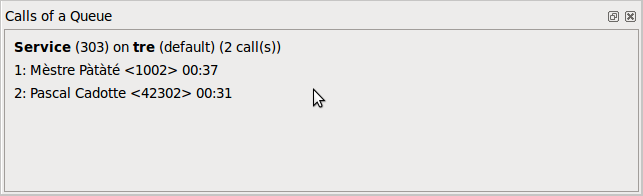

****************
Calls of a Queue
****************

Overview
========

The *Calls of a Queue* xlet show a list of waiting calls in the selected queue.

Usage
=====

When setting the focus on a queue in any xlet, the *Calls of a Queue* xlet will display
incoming calls in this queue and the waiting time for these calls.
