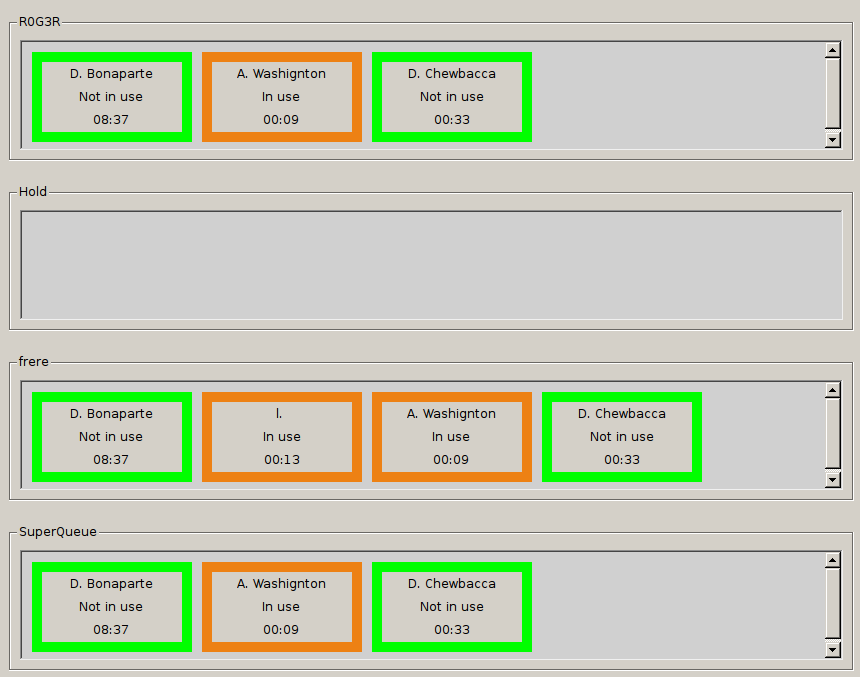

.. _dashboard-xlet:

**********************
Agent Status Dashboard
**********************

Overview
========

The goal of the agent status dashboard xlet is to give contact center supervisors a better overview of agent status evolution in active queues.

Usage
=====

The xlet is *read-only* and presents a list of queues. For each queue, the xlet displays a status box for each logged agents. Each status box gives the following information:

* Agent name
* Agent status: Shows the agent’s status. An agent can have six statuses:

  * *Not in use* when he is ready to answer an ACD call
  * *Int. Incoming* when he answered an internal call not from the queue
  * *Int. Outgoing* when he emitted an internal call not from the queue
  * *Ext. Incoming* when he answered an external call not from the queue
  * *Ext. Outgoing* when he emitted an external call not from the queue
  * *In use* when he is either on call from a queue, on pause or on wrapup

* Agent status since: Shows the time spent in the current status
* Background color:

  * green if *Not in use*
  * purple if *Int. Incomming* or *Int. Outgoing*
  * pink if *Ext. Incomming* or *Ext. Outgoing*
  * orange if *In use*

Note that the agent status will only change when the communication is established, not when phones are ringing.

Known bugs
^^^^^^^^^^

#. If an agent emits a call via its XiVO Client, the status will change to *Int. Outgoing* or *Ext. Outgoing* when the destination phone rings, instead of when the destination answers.

#.
 * Given the agent is on ACD call
 * When the agent logs out
 * When the agent hangs up the ACD call
 * When the agent logs back in via CTI Client
 * Then the agent is seen in outgoing non-ACD communication, whether there is a non-ACD communication or not

 To make the agent *Not in use* again, make a non-ACD call and hangup.

Changing the disposition
========================

The disposition of the Xlet can be changed in two ways:

* Placement of queues
* Which queues are displayed

The disposition is saved whenever the XiVO Client is closed and restored when it is opened again.

Changing the placement of queues
^^^^^^^^^^^^^^^^^^^^^^^^^^^^^^^^

The little windows containing each queue can be resized and moved around. That way, any layout can be achieved, according to the size and importance of each queue.

Choosing which queues are displayed
^^^^^^^^^^^^^^^^^^^^^^^^^^^^^^^^^^^

There is a little contextual menu when right-clicking on the title bar of every queue window. Checking/unchecking the lines of this menu shows/hides the associated queue.

.. figure:: ./images/dashboard_choosing_queues.png

.. _dashboard-xlet-issues:

Known issues
============

* There is no profile containing this xlet. Profile must be created manually.
* There is no sorting on agents in a queue.
* An emtpy queue will display an empty box with no message specifying the queue has no logged agents.

Configuration
=============

No special configuration necessary other than creating a CTI profile in which the Agent Status Dashboard is added.
