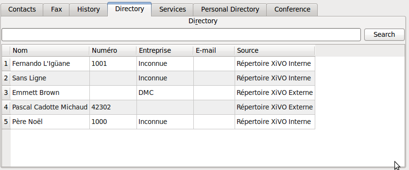

**************
Directory Xlet
**************

Overview
========

The directory xlet allow the user to search through the configured directories of the CTI server.

Usage
=====

Type the searched string in the search box and click the search button. If the search box is empty, all
phonebook entries will be displayed.

.. warning::

    Since phonebook access is managed by context, a user with no line will not receive
    any result.
