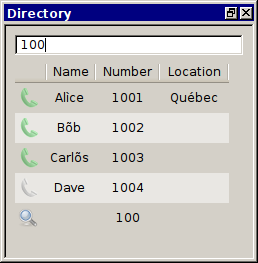
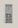
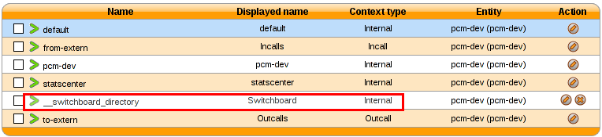
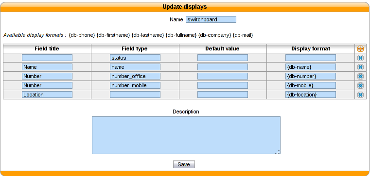
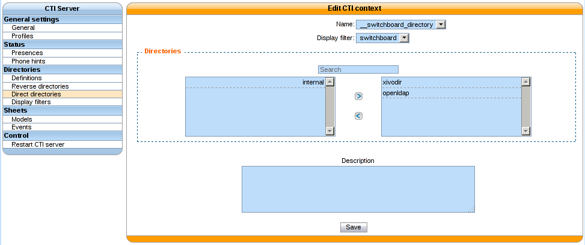

.. _directory-xlet:

**************
Directory Xlet
**************

Overview
========

.. warning:: This xlet should only be used with a Switchboard profile. It is not meant to be used
             alone.

The goal of the directory xlet is to allow the user to search through XiVO users, directory entries
and arbitrary numbers to be able to call and transfer calls to these destinations.

Usage
=====

The list of entries in the xlet is searched using the top field. Entries are filtered by column
content. The entry list will initially appear as empty.

If the current search term is a valid number, it will be displayed in the result list with no name
to allow transfer to numbers that are not currently in the phonebook or configured on the XiVO.

Legend
------

* Users available |user_available|
* Users ringing |user_ringing|
* Users talking |user_talking|
* Users |user|
* Mobile phone |mobile|
* External contacts |external|
* Current search (not a contact) |current_search|

.. |user_ringing| image:: images/directory_legend_user_ringing.png
   :align: middle
.. |user_talking| image:: images/directory_legend_user_talking.png
   :align: middle
.. |user| image:: images/directory_legend_user.png
   :align: middle

.. |external| image:: images/directory_legend_external.png
   :align: middle

Phonebook
=========

Phonebook searches are triggered after the user has entered 3 characters. Results from remote directories will appear after 1 second.

If a directory entry as the same number as a mobile or a phone configured on the XiVO, it's extra columns will be added to the corresponding entry instead of creating a new line in the search result.

For example:

If *User 1* has number *1000* and is also in a configured LDAP with a location in "Québec", if the display filter contains the *Location* column, the entry for *User 1* will show "Québec" in the *Location* column after the search results are received.

Configuration
-------------

Context
^^^^^^^

The directory xlet needs a special context named *__switchboard_directory*. In :menuselection:`Services --> IPBX --> IPBX configuration --> Contexts` add a new context with the following parameters :

* Name : ``__switchboard_directory``
* Type of context : **Other**
* Display name : Switchboard

Display filter
^^^^^^^^^^^^^^

A new display filter must be created for the directory xlet.

The following fields must be configured with the correct value for the *Field type* column in order for entries to be displayed in the xlet:

#. *status* is the column that will be used to display the status icon, the title can be empty
#. *name* is displayed in the *Name* column of the xlet
#. *number_office* is displayed in the *Number* column with a phone icon in the xlet
#. *number_mobile* is displayed in the *Number* column with a mobile icon in the xlet
#. *number_...* any other field starting with *number_* will be displayed in the *Number* column of the xlet with a generic directory icon
#. Any other field will be displayed in their own column of the directory xlet

The values in the *Field name* column must contain values that were created in the *Directory definition*.

The title used for the *Number* column is the title of the first field whose type starts with *number_*.

.. note::

    The field title of the first number column will be used for the header title
    in the xlet.

.. warning::

    Make sure that the fields entered in the display format are also available
    in the directory definition, otherwise the filter will not return any results

Context and filter association
^^^^^^^^^^^^^^^^^^^^^^^^^^^^^^

The new *Display filter* has to be assigned to the *__switchboard_directory* context

You can then choose which directories will be searched by the Xlet.

.. warning:: You must **not select internal** directory, as it is already handled.

LDAP Configuration
------------------

To search in ldap directories, you must have an LDAP server configured. See :ref:`ldap` for more details.

LDAP filter
^^^^^^^^^^^

If you already have an LDAP filter configured for the *Remote directory* Xlet, you can use it.

If not, please refer to :ref:`add-ldap-filter`.

Include the new directory for lookup
^^^^^^^^^^^^^^^^^^^^^^^^^^^^^^^^^^^^

You must use the new LDAP filter in the `Context and filter association`_ step.
