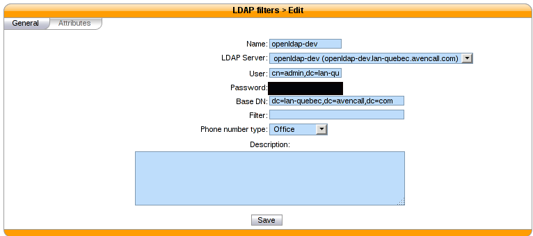
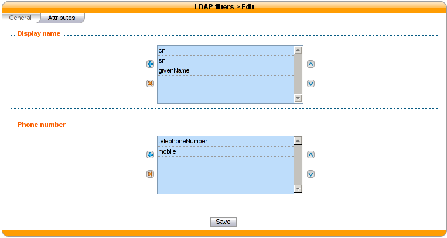
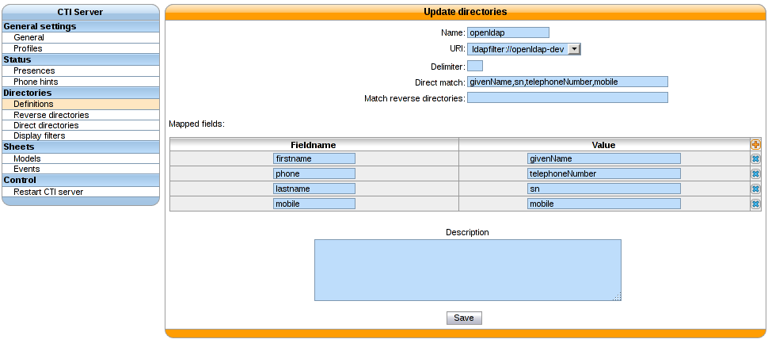

*********
Directory
*********

Overview
========

The directory xlet allow the user to search through the configured xivo directories and xivo users.

Usage
=====

The list of displayed directory entries is searched using to top field. Entries are filtered by
name and number. The entry list is originaly empty.

Phonebook
=========

Phonebooks lookup are triggered after the user has entered 3 characters. Results from remote
directories will appear after 1 seconds.

Configuration
-------------

Context
^^^^^^^

The directory xlet uses a special context named  *__switchboard_directory*. This context has to
be added as internal with no number range on the
:menuselection:`Services --> IPBX --> IPBX configuration --> Contexts` page.

.. figure:: ./images/switchboard_directory_context.png

Display filter
^^^^^^^^^^^^^^

A new display filter must be created for the directory xlet.

.. figure:: ./images/directory_display_filter.png

Some fields are required to be displayed in the *Directory* xlet:

#. *name* is displayed in the *Name* column of the xlet
#. *number_office* is displayed in the *Number* column with a phone icon in the xlet
#. *number_mobile* is displayed in the *Number* column with a mobile icon in the xlet
#. *number_...* any other field starting with *number_* will be displayed in the *Number* column of the xlet with a generic directory icon

The values in the *Display format* column contains values that are created in the *Directory Definition*

Context and filter association
^^^^^^^^^^^^^^^^^^^^^^^^^^^^^^

The new *Display filter* has to be assigned to the *__switchboard_directory* context

.. figure:: ./images/context_directory_association.png

You can then choose which directories will be searched by the Xlet.

.. note:: You must **not select internal** directory, as it is already handled.

LDAP Configuration
------------------

You must have a LDAP server connection configured. See :ref:`ldap`.

LDAP filter
^^^^^^^^^^^

If you already have a LDAP filter configured for the *Remote directory* Xlet, you can use it.

If not, you must add a LDAP filter in :menuselection:`IPBX --> IPBX configuration --> LDAP filters`.

The *Display name* attributes and phone number must be as shown above.

Directory definition
^^^^^^^^^^^^^^^^^^^^

A new directory definition must be added:

These fields are mandatory:

* firstname
* lastname
* phone

The direct match field must be a comma-separated list of the field values.

Include the new directory for lookup
^^^^^^^^^^^^^^^^^^^^^^^^^^^^^^^^^^^^

You must add the new LDAP filter in the directory list. See `Context and filter association`_.
