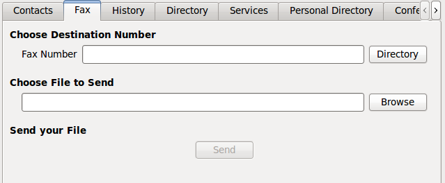

********
Fax Xlet
********

Overview
========

The Fax xlet allows the user to send faxes from his XiVO client.

Usage
=====

The *Fax number* field is the fax destination, directory search can be used to find the fax number
in available directories.
The *Choose a file to send* field is used to select which file you want to send.

Supported file type
===================

* pdf
* tiff
