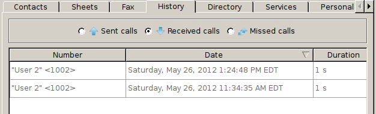

************
History Xlet
************

Overview
========

The history xlet allow the user to view his sent, received and missed calls.

Usage
=====

The history xlet is made of 3 different call categories, each of them being
mutually exclusive ie. a missed call is not in the incoming call list.

The user can right click on the caller to initiate a new call with a given
correspondant.

.. warning:: The column content is only refreshed when moving from one column to the other.

