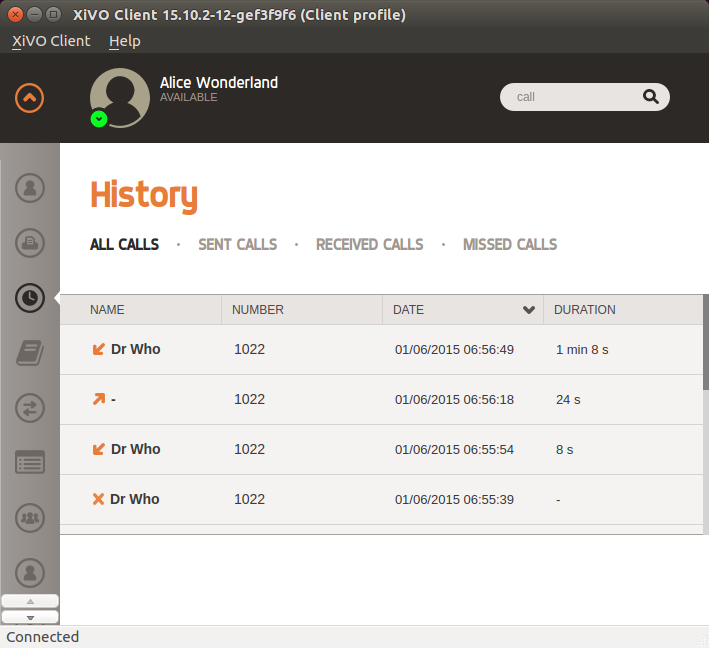

************
History Xlet
************

Overview
========

The history xlet allow the user to view his last calls. The user can filter by sent, received and missed calls.

Usage
=====

The user can click on the number of caller to initiate a new call with a given
correspondant.

.. warning:: The column content is only refreshed when moving from one view to the other.

