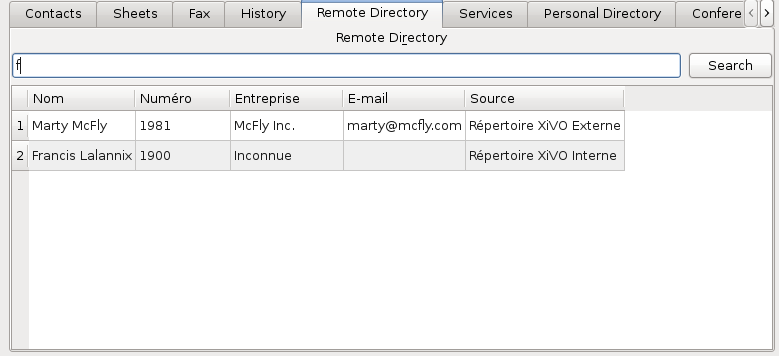
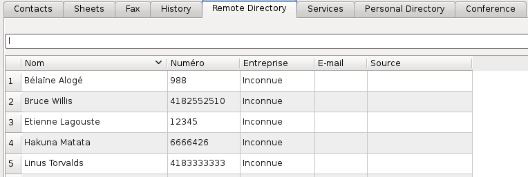

.. _remote_directory_xlet:

*********************
Remote Directory Xlet
*********************

Overview
========

The remote directory xlet allows the user to search through the configured directories of the CTI server.

Usage
=====

Type the search term in the search box and click on the search button. If the search box is empty, all
phonebook entries will be displayed.

Results can be sorted by clicking on one of the column headers. By default,
results are sorted using the first column.

    Example of contacts sorted by name

Your sorting preference will be saved and restored every time you reconnect.

.. warning::

    Since phonebook access is managed by context, a user with no line will not receive
    any result.
