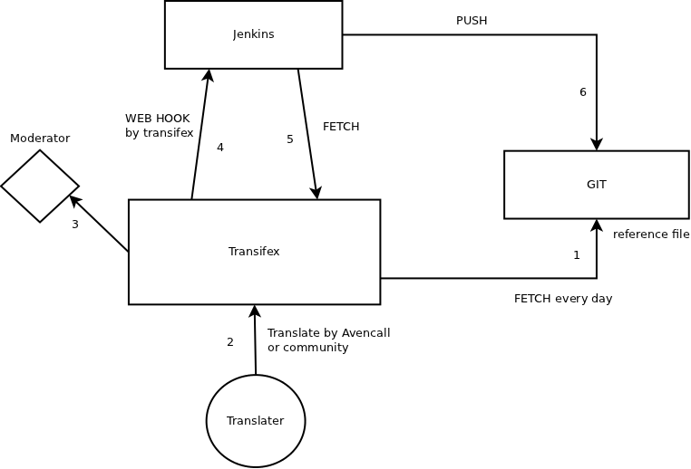

***********
Translation
***********

Now we are using a centralize tool for the xivo translation. It's transifex and the web acces is : 

* https://www.transifex.net/projects/p/xivo

For each project we have a reference file fetched by transiflex in our git. This file is always by default in english and translated with transifex.

XiVO Prompts
------------

We have different studio for each languages and prompts. The information for those languages are here :

* French : Super Sonic productions (supersonicprod@wanadoo.fr)
* English : Asterisk voice (allison@theasteriskvoice.com)
* German : ATS studio
* Italian : ATS studio

If you want to add a new prompt you need to edit the xivo-prompts-orig.csv in our git xivo-sounds.

Asterisk prompt
---------------

If you want to add a new prompt you need to edit the asterisk-prompts-orig.csv in our git xivo-sounds.

XiVO client
-----------

The file was generated by lupdate and the reference file is xivoclient-en.ts.

Web interface
-------------
