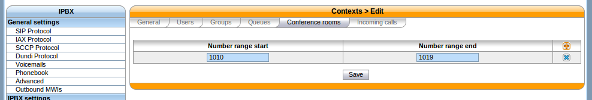

***************
Conference Room
***************

Adding a conference room
========================

In this example, we'll add a conference room with number 1010.

First, you need to define a conference room number range for the ''default'' context via the ''Services / IPBX / IPBX configuration / Contexts'' page.

   
   Adding a conference room number range to the default context

You can then create a conference room via the ''Services / IPBX / IPBX settings / Conference rooms'' page.

.. figure:: images/Confroom_create_1010.png
   :scale: 85%
   
   Creating conference room 1010

In this example, we have only filled the ''Name'' and ''Number'' fields, the others have been left to their default value.

As you can see, there's quite a few options when adding / editing a conference room. Here's a description of the most common one:

General / PIN code
 Protects your conference room with a PIN number. People trying to join the room will be asked for the PIN code.
General / Don't play announce for first participant
 Don't play the "you are currently the only person in this conference" for the first participant.
General / Max participants
 Limits the number of participants in the conference room. A value of 0 means unlimited.
 