***************
Getting Started
***************

This section will show you how to create a user with a SIP line. This simple use case covers what a lot of people need to start using a phone.
You can use these steps for connectinhg a softphone, a Linksys PAP2 or a SIP phone via the web interface.

This tutorial doesn't cover how to automatically provision a supported device. For this, you must refer to the :ref:`provisionning section. <intro-provisioning>`

We first need to log into the XiVO web interface. The web interface is where you can administer the whole system.

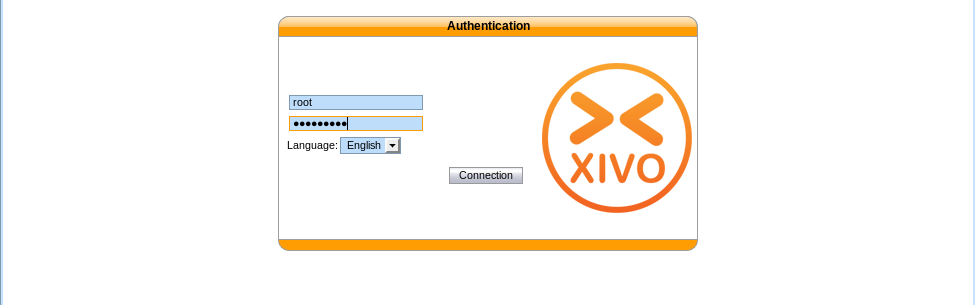

   Logging into the XiVO

When logged in, you will see a page with all the status information about your system.
This page helps you monitor the health of your system and gives you information about your network. Please note the IP address of your server,
you will need this information later on when you will configure your device (e.g. phone)

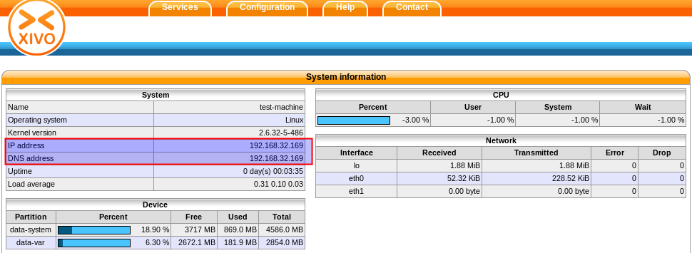

  System informations

To configure a device for a user, start by navigating to the IPBX menu. Hover over the `Services` tab, a dropdown menu will appear. Click on `IPBX`.

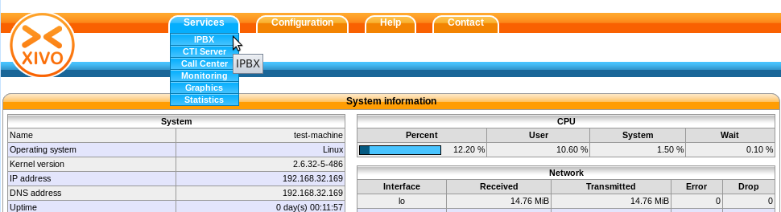

   Menu IPBX

Select the `Users` setting in the left menu.

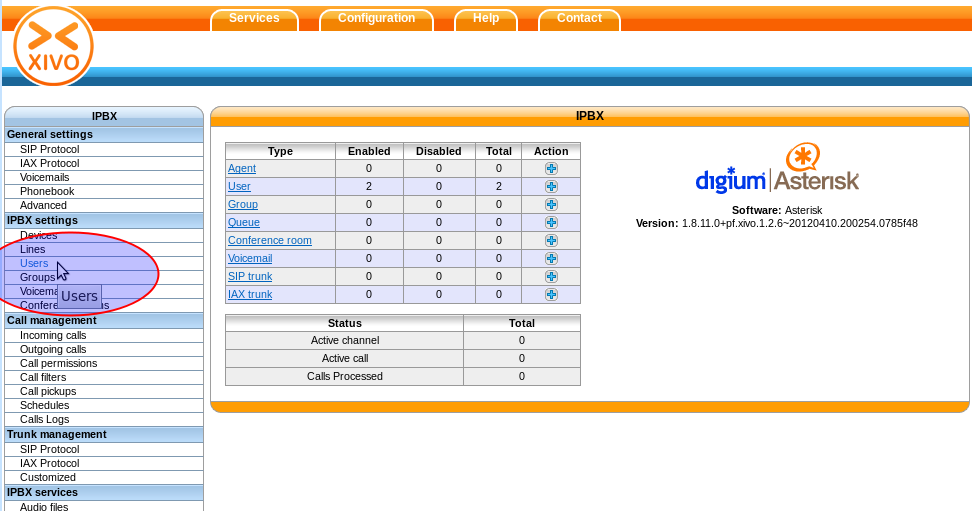

   Users settings

From here, press on the "plus" sign. A pop up will appear where you can click on `Add`.

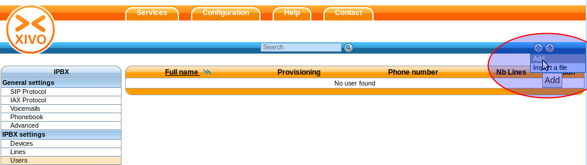

   Adding a new line

We now have the form that will allow us to create a new user. The three most important fields are 'First name', 'Last name' and 'Language'.
Fill in the fields and click on `Save` at the bottom. For our example, we will create a used called 'Alice Wonderland'.
 
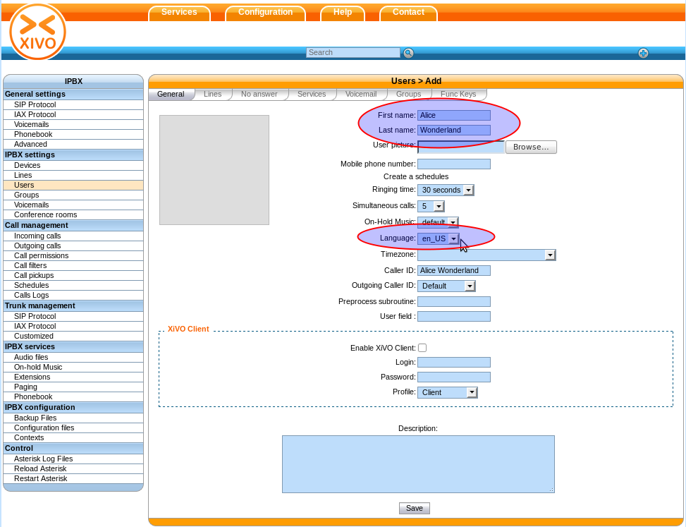

   User information

Afterwards, click on the "Lines" tab.

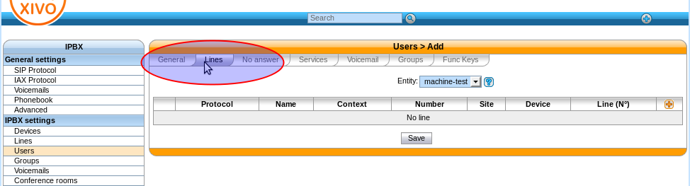

   Lines menu

Enter a number for your phone. If you click inside the field, you will see the range of numbers you can use. For our example, we will use '1000'.

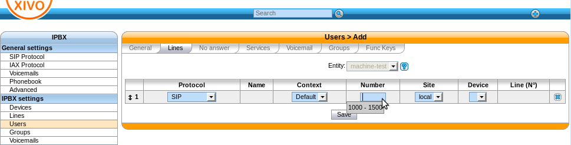

   Line information

By default, the selected protocol is SIP, which is what we want for now. Click on Save to create the line.

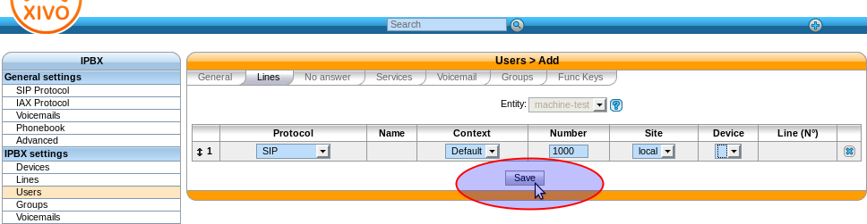

   Save

Yahoo ! we now have a user named 'Alice Wonderland' with the phone number '1000' !

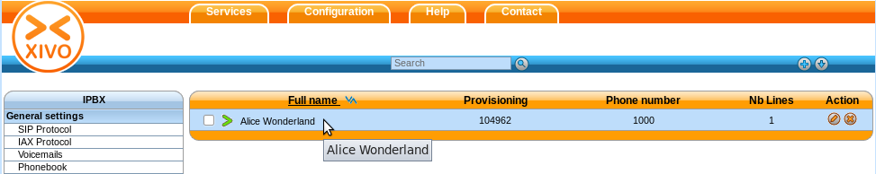

   User added information

Now we need to go get the SIP username and password to configure our phone.
Go back to the IPBX menu on the left, and click on 'Lines'.

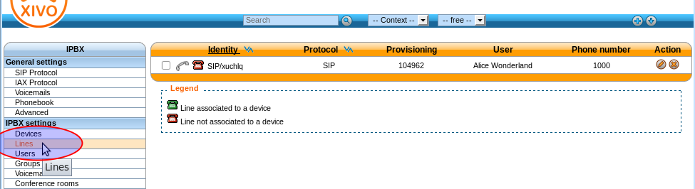

   Lines information

You will see a line associated with the user we just created. Click on the pencil icon to edit the line.

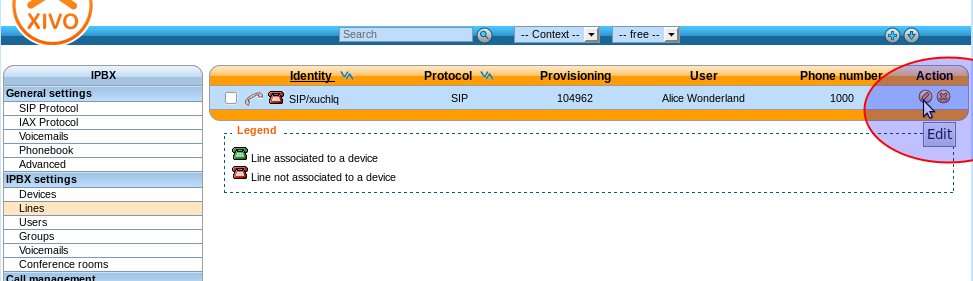

   Edit line

We can now see the username and password for the SIP line. you can configure your softphone, your linksys PAP2 or your SIP device by using the IP for your server, the username and the password.

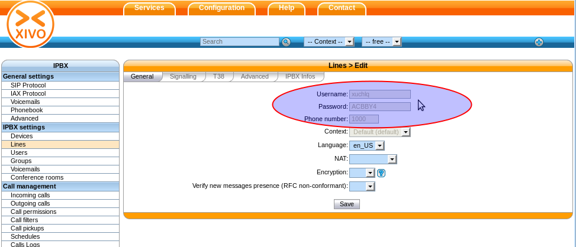

   General line information
