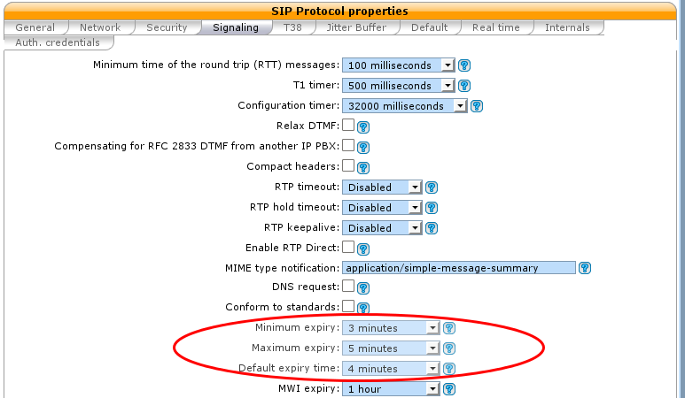
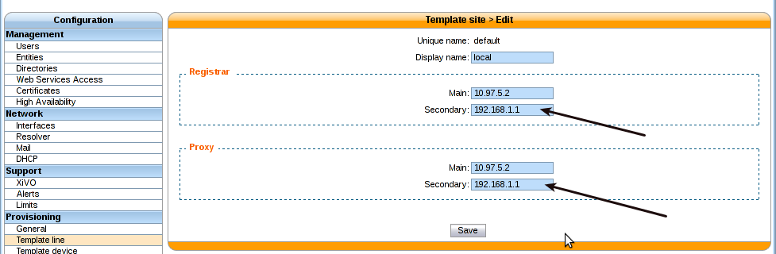
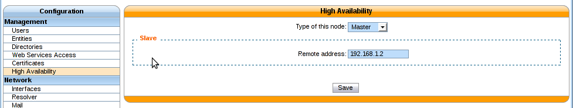

.. _high-availability:

**********************
High Availability (HA)
**********************

The :abbr:`HA (High Availability)` solution in XiVO makes it possible to maintain basic telephony
function whether your main XiVO server is running or not. When running a XiVO HA cluster, users are
guaranteed to never experience a downtime of more than 5 minutes of their basic telephony service.

The HA solution in XiVO is based on a 2-nodes "master and slave" architecture. In the normal
situation, both the master and slave nodes are running in parallel, the slave acting as a "hot
standby", and all the telephony services are provided by the master node. If the master fails or
must be shutdown for maintenance, then the telephony devices automatically communicate with the
slave node instead of the master one. Once the master is up again, the telephony devices failback to
the master node. Both the failover and the failback operation are done automatically, i.e. without
any user intervention, although an administrator might want to run some manual operations after
failback as to, for example, make sure any voicemail messages that were left on the slave are copied
back to the master.

Prerequisites
=============

The HA in XiVO only works with telephony devices (i.e. phones) that support
the notion of a primary and backup telephony server.

* Phones must be able to reach the master and the slave (take special care if master 
  and slave are not in the same subnet)
* If firewalling, the master must be allowed to join the slave on ports 22 and 5432
* If firewalling, the slave must be allowed to join the master with an ICMP ping
* Trunk registration timeout (``expiry``) should be less than 300 seconds (5 minutes)
* The slave must have no provisioning plugins installed.

The HA solution is guaranteed to work correctly with :ref:`the following devices <devices>`.

Quick Summary
=============

* You need two configured XiVO (wizard passed)
* Configure one XiVO as a master -> setup the slave address
* Restart services (xivo-service restart) on master
* Configure the other XiVO as a slave -> setup the master address
* Configure file synchronization by runnning the script ``xivo-sync -i`` on the master
* Start configuration synchronization by running the script ``xivo-master-slave-db-replication
  <slave_ip>`` on the master
* Resynchronize all your devices
* Configure the XiVO Clients

That's it, you now have a HA configuration, and every hour all the configuration done on the master
will be reported to the slave.

Configuration Details
=====================

First thing to do is to :ref:`install 2 XiVO <installation>`.

.. important:: When you upgrade a node of your cluster, you must also upgrade the other so that
   they both are running the same version of XiVO. Otherwise, the replication might not work
   properly.

You must configure the :abbr:`HA (High Availability)` in the Web interface
(:menuselection:`Configuration --> Management --> High Availability` page).

You can configure the master and slave in whatever order you want.

You must also run ``xivo-sync -i`` on the master to setup file synchronization.  Running ``xivo-sync
-i`` will create a passwordless SSH key on the master, stored under the :file:`/root/.ssh` directory,
and will add it to the :file:`/root/.ssh/authorized_keys` file on the slave. The following directories
will then be rsync'ed every hour:

* /etc/asterisk/extensions_extra.d
* /etc/xivo/asterisk
* /var/lib/asterisk/agi-bin
* /var/lib/asterisk/moh
* /var/lib/consul/raft
* /var/lib/xivo/certificates
* /var/lib/xivo/sounds/acd
* /var/lib/xivo/sounds/playback

.. warning:: When the HA is configured, some changes will be automatically
   made to the configuration of XiVO.

SIP expiry value on master and slave will be automatically updated:

* min: 3 minutes
* max: 5 minutes
* default: 4 minutes

   :menuselection:`Services --> IPBX --> General Settings --> SIP Protocol`

The provisioning server configuration will be automatically updated in order to allow
phones to switch from XiVO power failure.

   :menuselection:`Configuration --> Provisioning --> Template Line --> Edit default`

.. warning:: Especially not change these values when the HA is configured, this could cause problems.
   These values will be reset to blank when the HA is disabled.

.. important:: For the telephony devices to take the new proxy/registrar settings
   into account, you must :ref:`resynchronize the devices <synchronize-device>`
   or restart them manually.

Disable node
------------

Default status of :abbr:`High Availability (HA)` is disabled:

.. note:: You can reset at any time by choosing a server mode (disabled)

.. figure:: images/ha_dashboard_disabled.png

   HA Dashboard Disabled (default state)

.. important:: You have to restart services (xivo-service restart) once the master node is disabled.

Master node
-----------

In choosing the method ``Master`` you must enter the IP address of the slave node.

   HA Dashboard Master

.. important:: You have to restart all services (xivo-service restart) once the master node is configured.

Slave node
----------

In choosing the method ``Slave`` you must enter the IP address of master node.

.. figure:: images/ha_dashboard_slave.png

   HA Dashboard Slave

Replication Configuration
-------------------------

Once master slave configuration is completed, XiVO configuration is replicated from the master node
to the slave every hour (:00).

Replication can be started manually by running the replication scripts on the master::

   xivo-master-slave-db-replication <slave_ip>
   xivo-sync

The replication does not copy the full XiVO configuration of the master. Notably, these
are excluded:

* All the network configuration (i.e. everything under the
  :menuselection:`Configuration --> Network` section)
* All the support configuration (i.e. everything under the
  :menuselection:`Configuration --> Support` section)
* Call logs
* Call center statistics
* Certificates
* HA settings
* Provisioning configuration
* Voicemail messages

Less importantly, these are also excluded:

* Queue logs
* CELs

XiVO Client
-----------

You have to enter the master and slave address in the ``Connection`` tab of the
XiVO Client configuration :

.. figure:: images/xivoclient-config_ha.png

The main server is the master node and the backup server is the slave node.

When connecting the XiVO Client with the main server down, the login screen will
hang for 3 seconds before connecting to the backup server.

Internals
=========

4 scripts are used to manage services and data replication.

* xivo-master-slave-db-replication <slave_ip> is used on the master to replicate the master's
  data on the slave server. It runs on the master.
* xivo-manage-slave-services {start,stop} is used on the slave to start, stop monit and asterisk.
  The services won't be restarted after an upgrade or restart.
* xivo-check-master-status <master_ip> is used to check the status of the master and enable or
  disable services accordingly.
* xivo-sync is used to sync directories from master to slave.

Limitations
===========

When the master node is down, some features are not available and some behave a bit
differently. This includes:

* Call history / call records are not recorded.
* Voicemail messages saved on the master node are not available.
* Custom voicemail greetings recorded on the master node are not available.
* Phone provisioning is disabled, i.e. a phone will always keep the same configuration, even after
  restarting it.
* Phone remote directory is not accessible, because provisioned IP address points to the master.

Note that, on failover and on failback:

* DND, call forwards, call filtering, ..., statuses may be lost if changed recently.
* If you are connected as an agent, then you might need to reconnect as an agent
  when the master goes down. Since it's hard to know when the master goes down,
  if your CTI client disconnects and you can't reconnect it, then it's a sign
  the master might be down.

Additionally, only on failback:

* Voicemail messages are not copied from the slave to the master, i.e. if someone
  left a message on your voicemail when the master was down, you won't be able to
  consult it once the master is up again.
* More generally, custom sounds are not copied back. This includes recordings.

Here's the list of limitations that are more relevant on an administrator standpoint:

* The master status is up or down, there's no middle status. This mean that if Asterisk is crashed
  the XiVO is still up and the failover will NOT happen.

Berofos Integration
===================

.. toctree::
   :maxdepth: 2

   berofos

Troubleshooting
===============

When replicating the database between master and slave, if you encounter problems related to the
system locale, see :ref:`postgresql_localization_errors`.
