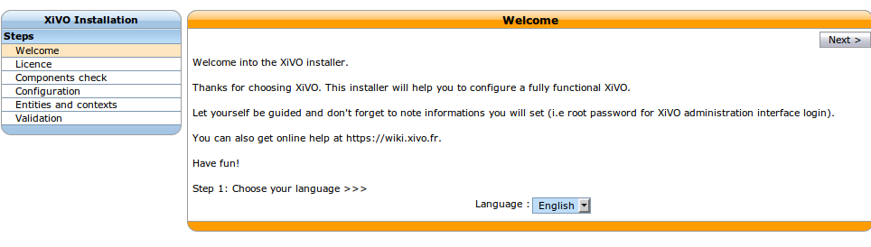
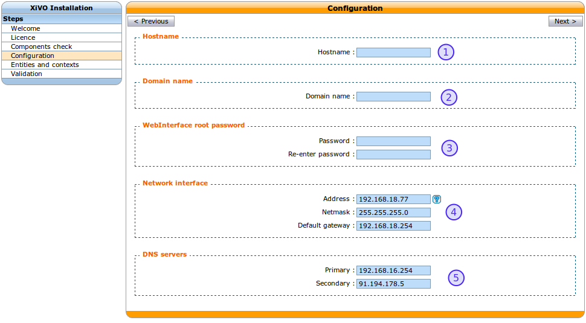

.. _configuration_wizard:

******************
Running the Wizard
******************

After the system installation, you must go through the wizard before being able to use your XiVO.
Open your browser and enter your server's IP address in the navigation bar. (For example:
http://192.168.1.10)

.. index:: wizard

Language
========

You first have to select the language you want to use for the wizard.

   Select the language

License
=======

You then have to accept the *GPLv3 License* under which XiVO is distributed.

.. figure:: images/wizard_step2_license.png
   :scale: 75%
   :alt: Accept the license

   Accept the license

Configuration
=============

   Basic configuration

#. Enter the hostname  (Allowed characters are : ``A-Z a-z 0-9 -``)
#. Enter the domain name (Allowed characters are : ``A-Z a-z 0-9 - .``)
#. Enter the password for the ``root`` user of the web interface,
#. Configure the IP address and gateway used by the VoIP interface
#. Finally, modify the DNS server information if needed.

Entities and Contexts
=====================

Contexts are used for managing various phone numbers that are used by your system.

* The Internal calls context manages extension numbers that can be reached internally
* The Incalls context manages calls coming from outside of your system
* The Outcalls context manages calls going from your system to the outside

.. figure:: images/wizard_step5_entities_contexts.png
   :scale: 75%
   :alt: Entities and Contexts

   Entities and Contexts

#. Enter the entity name (e.g. your organization name) (Allowed characters are : ``A-Z a-z 0-9 -
   .``)
#. Enter the number interval for you internal context. The interval will define the users's phone
   numbers for your system (you can change it afterwards)
#. Enter the DID range and DID length for your system.
#. You may change the name of your outgoing calls context.

Validation
==========

Finally, you can validate your configuration by clicking on the ``Validate`` button.
Note that if you want to change one of the settings you can go backwards in the wizard by clicking
on the ``Previous`` button.

.. warning:: This is the last time the ``root`` password will be displayed. Take care to note it.

Congratulations, you now have a fully functional XiVO server.

To start configuring XiVO, see :ref:`getting_started`.
