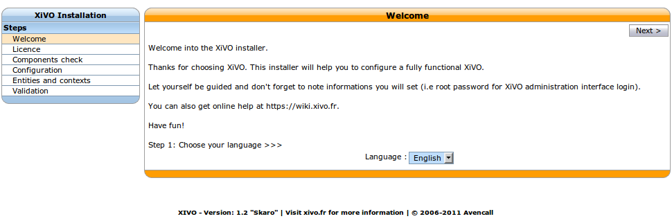

********************
Configuration Wizard
********************

After the first installation, you have to go through the wizard steps to initialize XiVO configuration.

Language
========

You first have to select the language you want to use

         
         Adding a new virtual interface

License
=======

IPBX Engine
===========

Database
========
