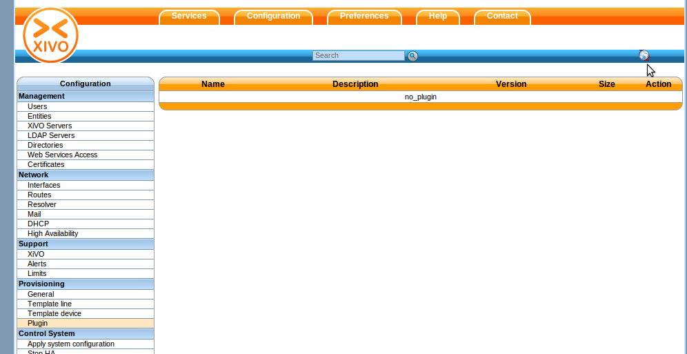
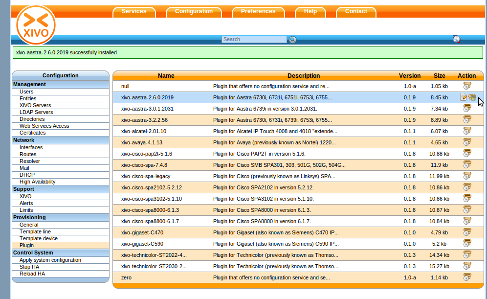
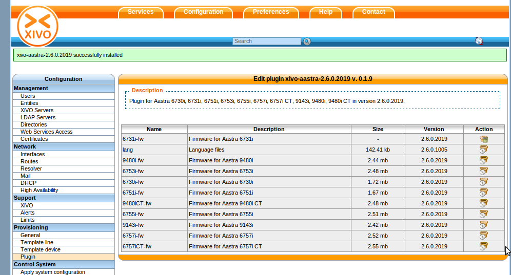
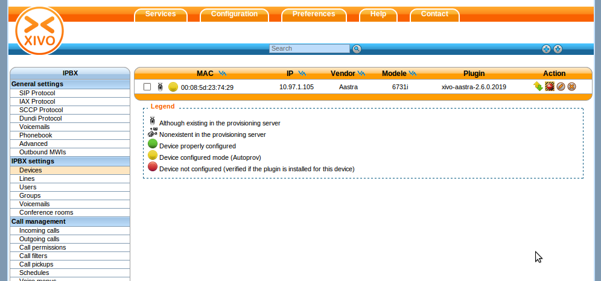
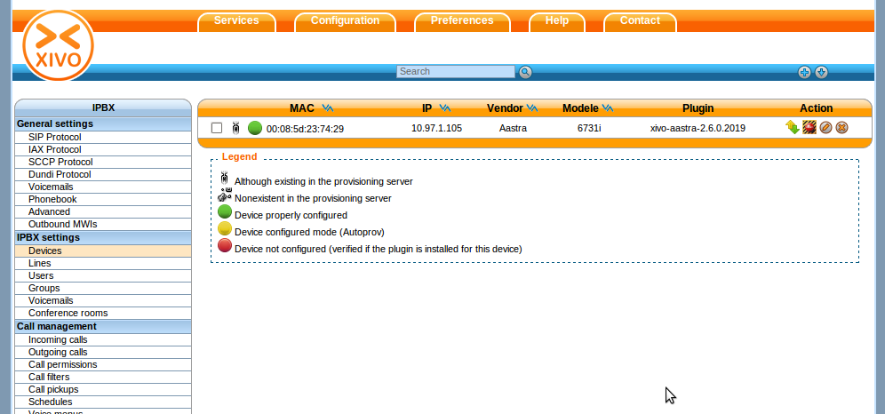

*******************
Basic configuration
*******************

.. _dhcpd-config:

Configuring the DHCP server
===========================

XiVO includes a DHCP server that facilitate the auto-provisioning of telephony devices.
It is *not* activated by default.

There's a few things to know about the peculiarities of the included DHCP server:

* it only answer to DHCP requests from :ref:`supported devices <devices>`.
* it only answer to DHCP requests coming from the VoIP subnet

This means that if your phones are on the same broadcast domain than your computers,
and you would like the DHCP server on your XiVO to handle both your phones and your
computers, that won't do it.

The DHCP server is configured via the :menuselection:`Configuration --> Network --> DHCP` page:

.. figure:: img/dhcp.png
   :scale: 85%

   :menuselection:`Configuration --> Network --> DHCP`

Active
   Activate/desactivate the DHCP server.

Pool start
   The lower IP address which will be assigned dynamically. This address should
   be in the VoIP subnet. Example: ``10.0.0.10``.

Pool end
   The higher IP address which will be assigned dynamically. This address should
   be in the VoIP subnet. Example: ``10.0.0.99``.

Extra network interfaces
   A list of space-separated network interface name. Example: ``eth0``.

   Useful if you have done some custom configuration in the :file:`/etc/dhcp/dhcpd_extra.conf`
   file. You need to explicitly specify the additional interfaces the DHCP server should
   listen on.

After saving your modifications, you need to click on :guilabel:`Apply system configuration`
for them to be applied.

.. _provd-plugins-mgmt:

Installing ``provd`` plugins
============================

The first thing you need to do is to install the provd plugins for your devices. 
It won't be possible for your devices to be properly configured if you don't install a proper provd plugin.

Via the web-interface, you can update the list of installable plugins by going in 
Configuration / Provisioning / Plugin and clicking the small update button in the upper right corner: 

   :menuselection:`Configuration --> Provisioning --> Plugin`

You will then have a list of installable provd plugins to choose from: 

.. figure:: img/Autoprov_provd_plugins_list.png
   :scale: 85%

   The page shows the list of both the installed and installable plugins. You can
   see if a plugin is installed or not by looking at the :guilabel:`Action` column.

Here's the list of other things that can be done from this page:

* update the list of installable plugins, by clicking on the top right icon. On a fresh
  XiVO installation, this is the first thing to do.
* install a new plugin
* upgrade an installed plugin
* uninstall an installed plugin
* edit an installed plugin, i.e. install/uninstall optional files that are specific to each plugin, like
  firmware or language files

You can then install the provd plugins that you want by clicking the install icon for each plugins. 
In our example, since we have Aastra 6731i phones, and we want to use the latest firmware from the 
2.6 series (and not the 3.2 series), we'll install the xivo-aastra-2.6.0.2019 provd plugin: 

   
   You can also use the search box if you are looking for a particular word.

After installing a new plugin, you are automatically redirected to its edit page. You
can then download and install optional files specific to the plugin. You are strongly
advised to install firmware and language files for the phones you'll use although
it's often not a strict requirement for the phones to work correctly.

Once the xivo-aastra-2.6.0.2019 plugin is installed, you can download and install the firmware for 
your 6731i by clicking the edit icon of the xivo-aastra-2.6.0.2019 plugin and then clicking the 
install icon for the 6731i-fw package. After the download, you should see something like this: 

.. warning::
   If you uninstall a plugin that is used by some of your devices, they will be
   left in an unconfigured state and won't be associated to another plugin
   automatically.

The search box at the top comes in handy when you want to find which plugin to install
for your device. For example, if you have a Cisco SPA508G, enter "508" in the search box
and you should see there's 1 plugin compatible with it.

.. note::
   If your device has a number in its model name, you should use only the number as the search keyword
   since this is what usually gives the best results.

It's possible there will be more than 1 plugin compatible with a given device. In these cases,
the difference between the two plugins is usually just the firmware version the plugins target.
If you are unsure about which version you should install, you should look for more information
on the vendor website.

It's good practice to only install the plugins you need and no more.

Autoprovisioninging a device
============================

Once you have installed the proper provd plugins for your devices and setup correctly your 
DHCP server, you can then connect your devices to your network.

But first, go to Services / IPBX / Devices. You will then see that no devices are currently known 
by your XiVO:

.. figure:: img/Autoprov_no_devices.png
   :scale: 85%

You can then power on your devices on your LAN. For example, after you power on your Aastra 6731i and 
give it the time to boot and maybe upgrade its firmware, you should then see the phone having its first 
line configured as 'autoprov', and if you refresh the devices page, you should see that your XiVO 
now knows about your 6731i: 

You can then dial from your Aastra 6731i the provisioning code associated to a line of one of your user.
You will hear a prompt thanking you and your device should then reboot in the next few seconds. 
Once the device reboot, it will then be properly configured for your user to use it. And also, 
if you update the device page, you'll see that the icon next to your device has now passed to green: 

