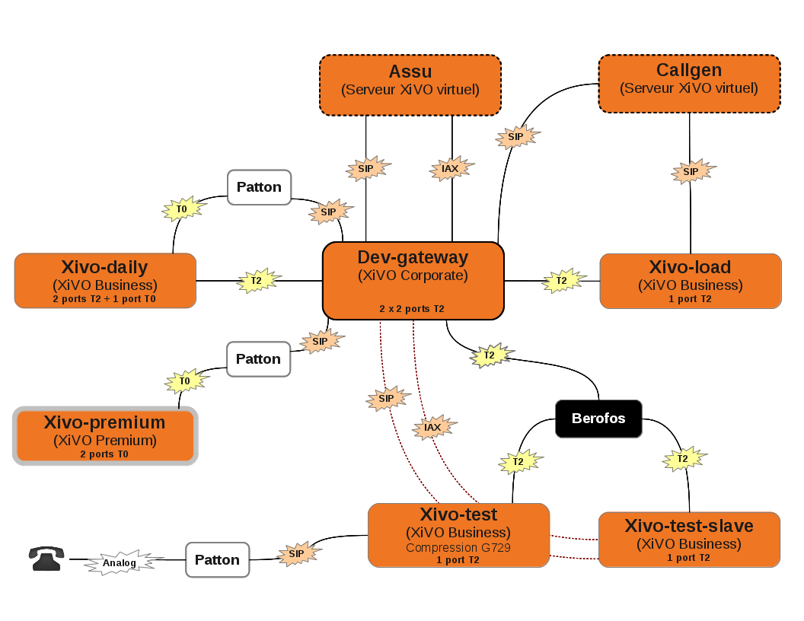

*****************
Quality assurance
*****************

Testing architecture
====================

   Testing architecture

Legend:

* assu is our production Wazo, used to make calls in the company. We also use it as a source of
  "external" calls to the test servers.
* dev-gateway is a simple gateway, to link all other servers.
* xivo-daily is reinstalled every day and runs all the automatic tests in `xivo-acceptance`_.
* xivo-load handles a lot of calls all day long, and we monitor the system metrics while it does.
* callgen makes the calls towards xivo-load
* xivo-test and xivo-test-slave are used for manual tests we run before each release
* xivo-premium (not yet installed) will allow us to test the new xivo-premium hardware

.. _xivo-acceptance: https://github.com/wazo-pbx/xivo-acceptance
