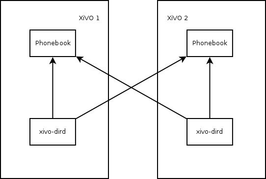
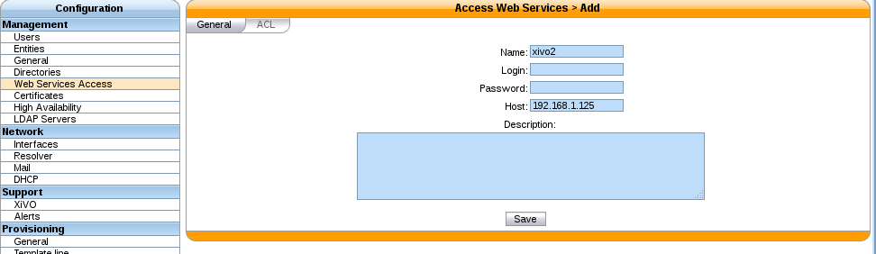
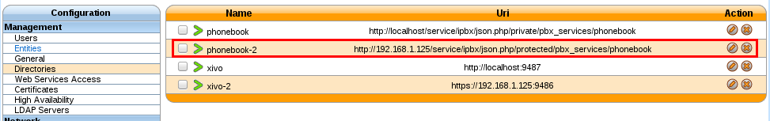
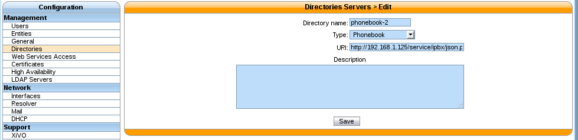
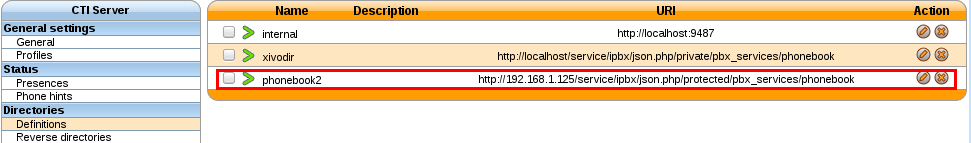
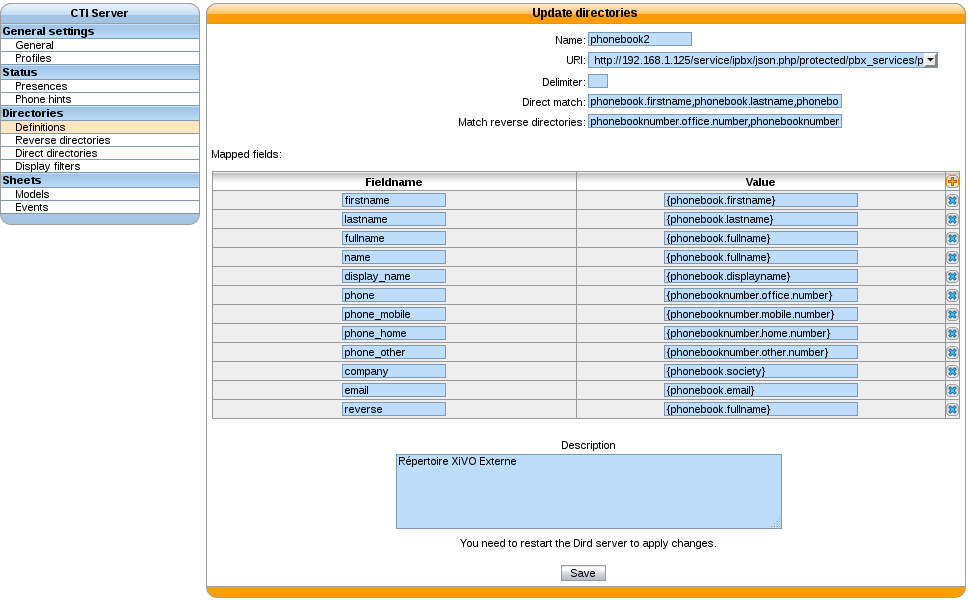
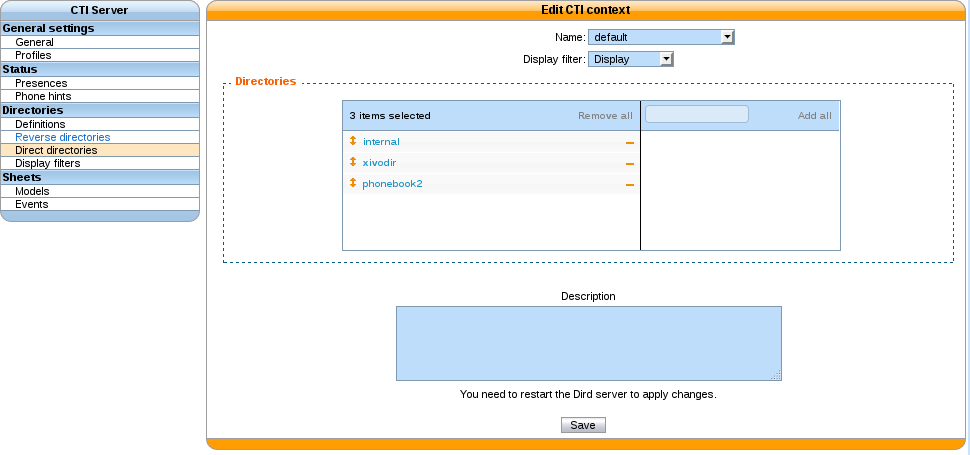

.. _phonebook_sharing:

*****************
Phonebook Sharing
*****************

Sharing phonebooks allows users of different XiVO servers to access the contacts in the
:ref:`phonebooks <phonebook>` of the other XiVO servers.

This procedure follows the :ref:`contact_and_presence_sharing` (but it's not mandatory), so we will
use the same conventions.

Open Phonebook Access
=====================

On each XiVO, you must have a :ref:`Web Services User <web_services_access>` that authorizes access
from another host (not by login/password). The phonebook access does not support login/password
authorization.

This Web Services user will allow other XiVO servers to access the phonebook of this XiVO.

Configuring the Directories
===========================

For each remote XiVO a new phonebook has to be created in
:menuselection:`Configuration --> Management --> Directories`

Note that the URL of the directory must contain ``restricted``, not ``private``, e.g::

   http://192.168.1.125/service/ipbx/json.php/restricted/pbx_services/phonebook

Add a Directory Definition for Each Phonebook
---------------------------------------------

To add a new directory definition, go to :menuselection:`Services --> CTI Server
--> Directories --> Definitions`

In each directory definition, add the fields to match the other phonebooks:

Add the New Definitions to Your Users
-------------------------------------

We just defined the directories, now let's use them:

.. figure:: images/list_direct_directories.png

Check That Everything is Working
================================

There is no further configuration needed, you should now be able to connect your XiVO Client and
search phonebook contacts from the People Xlet.

Troubleshooting
===============

Chances are that everything won't work the first time, here are some interesting
commands to help you debug the problem.

.. code-block:: sh

    tail -f /var/log/xivo-dird.log
    tail -f /var/log/nginx/xivo.access.log
