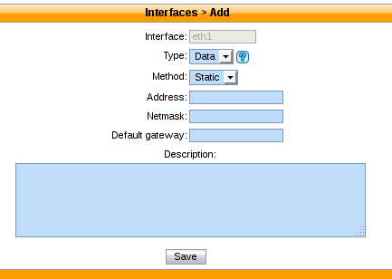
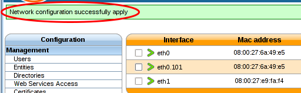

.. _network_configuration:

*******
Network
*******

.. index:: network

You **must** configure your network interfaces directly from the XiVO web interface via the
:menuselection:`Configuration --> Network --> Interfaces` page.

The Voip interface is used by the DHCP server and the provisioning server.

How-to
------

You can only have one VoIP interface, which is eth0 by default. This interface is configured during the wizard.

The DHCP server and provisioning server, among other, use information from the VoIP interface in its configuration.
For example, the DHCP server will only listen on the VoIP interface per default.

To change this interface, you must either create a new one or edit an existing one and change its type to VoIP.
The type of the old interface will automatically be changed to the 'data' type.

Configuring a physical interface
--------------------------------
In this example, we'll add and configure the *eth1* network interface on our XiVO.

First, we see there's already an unconfigured network interface named ''eth1'' on our system:

.. figure:: images/netiface_list_post_wizard.png

Listing the network interfaces

To add and configure it, we click on the small plus button next to it, and we get to this page:

Configure physical interface

In our case, since we want to configure this interface with static information (i.e. not via DHCP), 
we fill the following fields:

.. figure:: images/netiface_edit_physical_filled.png
 
Configure physical interface

Note that since our ''eth0'' network interface already has a default gateway,
we do not enter information in the ''Default gateway'' field for our ''eth1'' interface.

Once we click on ''Save'', the XiVO will put the ''Apply network configuration'' button in bold.

To reconfigure the given network interface with the new information, you click on it.

.. figure:: images/netiface_notify_change.png
   :figclass: align-center

   Apply after modify interface

.. index:: single:VLAN

Adding a VLAN interface
-----------------------

First, we see there's already a configured network interface on our system:

.. figure:: images/netiface_list_configured.png

Listing the network interfaces

To add and configure a new VLAN interface, we click on the small plus button in the top right corner,

   
   Adding button

and we get to this page:

.. figure:: images/netiface_add_virtual_empty.png
   :figclass: align-center
   
   Adding a new virtual interface

In our case, since we want to configure this interface with static information:

.. figure:: images/netiface_add_virtual_filled.png
   :figclass: align-center

   Adding a new virtual interface

Click on **Save** list the network interfaces:

.. figure:: images/netiface_list_new_virtual.png
   :figclass: align-center
      
   Listing the network interfaces

- The new virtual interface has been successfully created.

.. note:: 
   Do not forget after you finish the configuration of the network to apply it with the button: 
   **Apply network configuration**

After applying the network configuration:

   Listing the network interfaces

Add static network routes
-------------------------

Static route can't be currently added via the web interface.
If you want static routes in your XiVO you should do the following steps described below.
It would ensure that your static routes are applied at startup (in fact each time the network interface goes up).

#. Create the file :file:`/etc/network/if-up.d/xivo-routes`::

    touch /etc/network/if-up.d/xivo-routes
    chmod 755 /etc/network/if-up.d/xivo-routes

#. Insert the following content::

    #!/bin/sh
    
    if [ "${IFACE}" = "<network interface>" ]; then
        ip route add <destination> via <gateway>
        ip route add <destination> via <gateway>
    fi

#. Fields <network interface>, <destination> and <gateway> should be replaced by your specific configuration.
   For example, if you want to add a route for 192.168.50.128/25 via 192.168.17.254 which should be added
   when eth0 goes up::
    
    #!/bin/sh
    
    if [ "${IFACE}" = "eth0" ]; then
        ip route add 192.168.50.128/25 via 192.168.17.254
    fi

.. note:: The above check is to ensure that the route will be applied only if the correct interface goes up.
    This check should only contain a *physical* interface name (i.e. `eth0` or `eth1` or ...).
    If the interface to which the route is to be applied is a VLAN interface (e.g. `eth0.100` for VLAN 100)
    you *MUST* put `eth0` in the test (instead of `eth0.100`).
    Otherwise the route won't be set up in every cases.

Change interface MTU
--------------------

.. warning::
   Changing the MTU is risky. You should know what you are doing.

If you need to change the MTU here is how you should do it:

#. Create the file :file:`/etc/network/if-up.d/xivo-mtu`::

     touch /etc/network/if-up.d/xivo-mtu
     chmod 755 /etc/network/if-up.d/xivo-mtu

#. Insert the following content::

     #!/bin/sh

     # Set MTU per iface
     if [ "${IFACE}" = "<data interface>" ]; then
         ip link set ${IFACE} mtu <data mtu>
     elif [ "${IFACE}" = "<voip interface>" ]; then
         ip link set ${IFACE} mtu <voip mtu>
     fi

#. Change the *<data interface>* to the name of your interface (e.g. eth0), and the *<data mtu>* to the new MTU (e.g. 1492),
#. Change the *<voip interface>* to the name of your interface (e.g. eth1), and the *<voip mtu>* to the new MTU (e.g. 1488)

.. note::
   In the above example you can set a different MTU per interface.
   If you don't need a per-interface MTU you can simply write::

     #!/bin/sh

     ip link set ${IFACE} mtu <my mtu>

