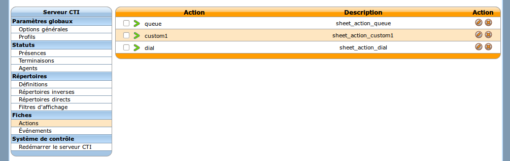
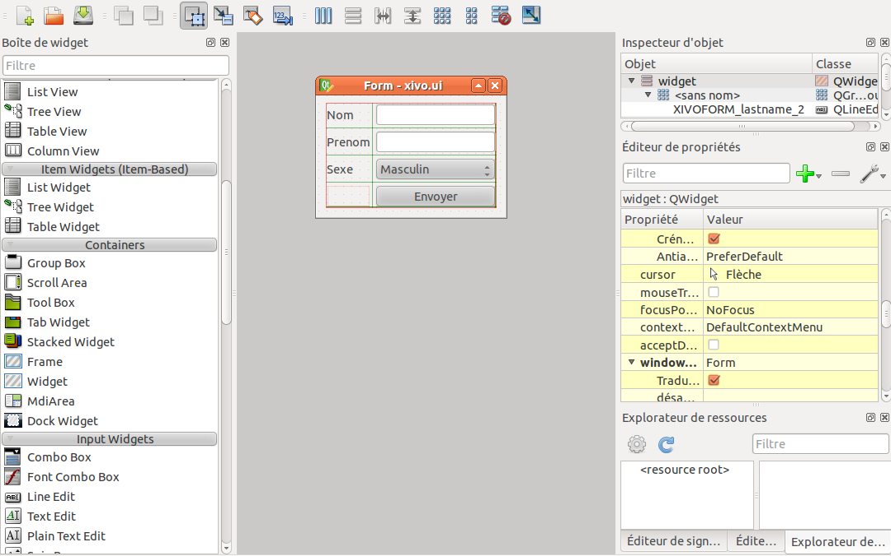
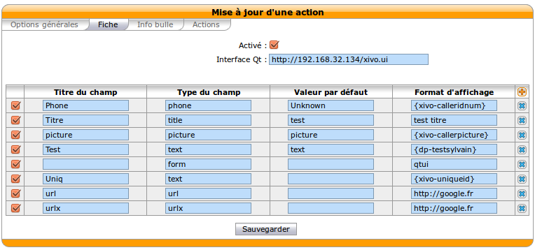
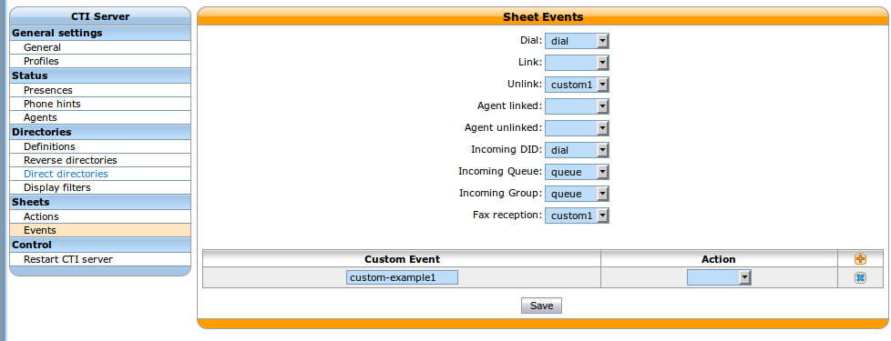

**********
CTI Server
**********

.. index:: ctiserver

The CTI server configuration options can be found in the web-interface under the services tab. 

General Options
===============

The general options allow the administrator to manage network connections between the CTI server 
and other services and clients.

The section named AMI connection allows the administrator to configure the
information required to connect to the Asterisk Manager Interface
(AMI). These fields should match the entries in `/etc/asterisk/manager.conf`.

.. image:: images/ami_connection.png

The section named ``Listening Ports`` allows the administrator to specify listening
addresses and ports for the CTI server's interfaces.

* Fast AGI is the CTI server's entry point for the Asterisk dialplan. This
  address and port have nothing to do with the listening port and address of
  xivo-agid.
* CTI and CTIs are for the client's connection and secure connection respectively.
* Web Interface is for the port used to receive events from the XiVO web interface
* Info server a debugging console to do some introspection on the state of the CTI server
* Announce is used to notify the CTI server when a dialplan reload is requested

.. image:: images/listening_ports.png

The timeout section allow the administrator to configure multiple timeouts.

* Update period is a poll delay to retrieve new information from the web services.
* Socket timeout is the default timeout used for network connections.
* Login timeout is the timeout before a CTI connection is dropped if the
  authentication is not completed.

.. image:: images/cti_timeout.png

Parting options are used to isolate XiVO users from each other. These options
should be used when using the same XiVO for different enterprises.

Context separation is based on the user's line context. A user
with no line is not the member of any context and will not be able to do
anything with the CTI client.

.. image:: images/parting_options.png

Sheet Configuration
===================

For any sheet you may define 2 different configurations: Actions and Events.

Action
   Design of the sheet, and the action needed.
Event
   Type of the sheet for a specific event. For example if you want to define a sheet when you received a call from a queue, 
   you can create a model of your sheet in the action, and associate your event to this sheet.

General Option
--------------

In the first tab the name of your model can be configured, the destination (just dest for the moment).
When you checkbox focus is checked, your xivo client focus when you received a sheet.
Contexts contain where the event sheet can be triggered. Profil is to authorize a specific profil in this model sheet.
Anyway you can fill a description.

.. image:: images/sheets_configuration_general.png

Sheets
------

This tab is dedicated for the form/information of your sheet. You can define an external form created with qt-designer. 
You can configure the path to a file:// or  http://. The check box is for activated this ui. The qt file is an xml file.

Here an example of a small form develop with qt-designer.

.. image:: images/sheets_configuration_qtui.png

The qt-designer screenshot.

the generated file from qt-designer :

.. code-block:: javascript

 <?xml version="1.0" encoding="UTF-8"?>
 <ui version="4.0">
  <class>widget</class>
  <widget class="QWidget" name="widget">
   <property name="geometry">
    <rect>
     <x>0</x>
     <y>0</y>
     <width>225</width>
     <height>146</height>
    </rect>
   </property>
   <property name="windowTitle">
    <string>Form</string>
   </property>
   <layout class="QVBoxLayout" name="verticalLayout">
    <item>
     <layout class="QGridLayout">
      <item row="0" column="0">
       <widget class="QLabel" name="label">
        <property name="text">
         <string>Nom</string>
        </property>
       </widget>
      </item>
      <item row="1" column="0">
       <widget class="QLabel" name="label_2">
        <property name="text">
         <string>Prenom</string>
        </property>
       </widget>
      </item>
      <item row="2" column="0">
       <widget class="QLabel" name="label_3">
        <property name="text">
         <string>Sexe</string>
        </property>
       </widget>
      </item>
      <item row="1" column="1">
       <widget class="QLineEdit" name="XIVOFORM_lastname_2"/>
      </item>
      <item row="0" column="1">
       <widget class="QLineEdit" name="XIVOFORM_name"/>
      </item>
      <item row="3" column="1">
       <widget class="QPushButton" name="save">
        <property name="text">
         <string>Envoyer</string>
        </property>
       </widget>
      </item>
      <item row="2" column="1">
       <widget class="QComboBox" name="comboBox">
        <item>
         <property name="text">
          <string>Masculin</string>
         </property>
        </item>
        <item>
         <property name="text">
          <string>Féminin</string>
         </property>
        </item>
       </widget>
      </item>
     </layout>
    </item>
   </layout>
  </widget>
  <resources/>
  <connections/>
  </ui>

On the second part you can configure the form:

 * Field title : name of your line
 * Field type : define the type like text, form ...
 * phone : create a tel: link, you can click to call on your sheet
 * title : to create a title on your sheet
 * picture : show a picture from an internal user in your sheet, you need to use {xivo-picture} variable.
 * text : show a text
 * form : show the form from an ui predefined. It's an xml ui. You need to define qtui in display format.
 * url : a simple url link, open your default browser.
 * urlx : an url button

The third field is to define a text when the fourth field have no result. It's the default display.

In the fourth field, you can defined text or variables or both.
Three kinds of variables are available

`xivo-` prefix is reserved and set inside the CTI server:
 
 * `xivo-where` for sheet events, event triggering the sheet
 * `xivo-origin` place from where the lookup is requested (did, internal, forcelookup)
 * `xivo-direction` incoming or internal
 * `xivo-did` DID number
 * `xivo-calleridnum`
 * `xivo-calleridname`
 * `xivo-calleridrdnis` contains information whether there was a transfer
 * `xivo-calleridton` Type Of Network (national, international)
 * `xivo-calledidnum`
 * `xivo-calledidname`
 * `xivo-context`
 * `xivo-ipbxid` (`xivo-astid` in 1.1)
 * `xivo-directory` : for directory requests, it is the directory database the item has been found
 * `xivo-queuename` queue called
 * `xivo-agentnumber` agent number called
 * `xivo-date` formatted date string
 * `xivo-time` formatted time string
 * `xivo-channel` asterisk channel value (for advanced users)
 * `xivo-uniqueid` asterisk uniqueid value (for advanced users)

`db-` prefixed variables are defined in the WEBI configuration, and depend on the matching list. Common values are :
 
 * `db-phone`
 * `db-firstname`
 * `db-lastname`
 * `db-company`

`dbr-` contains one single item `dbr-display` that is used in the setting of what is displayed on phones, 
and is typically a mix of firstname and lastname

`dp-` prefixed ones are the variables set through the dialplan (through UserEvent application)

For example if you want to access from the dialplan to a variable dp-test you need to add in your dialplan this line (in a subroutine) :

 UserEvent(dialplan2cti,UNIQUEID: ${UNIQUEID},CHANNEL: ${CHANNEL},VARIABLE: test,VALUE: "Salut")

The {dp-test} displays Salut.

Warning : qtui are the exception for the form.

Other example :

 * title : (anything, "title", default value, variable pattern)
 * text item : (anything, "text", default value, variable pattern)
 * ui form : (anything, "form", anything, "qtui")
 * user picture : (anything, "picture", anything, {xivo-callerpicture})

Systray
-------

Exactly the same syntax as the sheet. You can just use text.

.. image:: images/sheets_configuration_systray.png

Actions
-------

The action is for the xivo client, so if you configure an action, please do sure you understand it's executed by the client. 
You need to allow this action in the client configuration too.

The second and fourth field must be used. And the second is always urlauto. You can use the same variable like {xivo-callerid}

 * `http://x.y.z.co.fr/anything` opens the URL on the default browser
 * `tcp://x.y.z.co.fr:4545/?var1=a1&var2=a2&var3=v3` connects to TCP port 4545 on x.y.z.co.fr, sends the string `var1=a1&var2=a2&var3=v3`, then closes
 * `udp://x.y.z.co.fr:4545/?var1=a1&var2=a2&var3=v3` connects to UDP port 4545 on x.y.z.co.fr, sends the string `var1=a1&var2=a2&var3=v3`, then closes

.. note:: any string that would not be understood as an URL will be handled like and URL
   it is a process to launch and will be executed as it is written

For `tcp://` and `udp://`, it is a requirement that the string between `/` and `?` is empty.
An extension could be to define other serialization methods, if needed.

.. image:: images/sheets_configuration_actions.png

Event configuration
===================

Dialplan interaction
--------------------

* UserEvents for a custom event.

 UserEvent(Custom,NAME: myevent,UNIQUEID: ${UNIQUEID},CHANNEL: ${CHANNEL})
