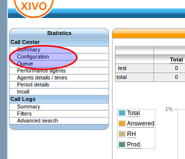

**************
Contact Center
**************

Statistics
==========

Introduction
------------

In order to be able to display call center statistics you have first to create one or more configuration.

This configuration is used to generate statistic cache and to allow user to display statistic with XiVO web interface

General Architecture
--------------------

.. image:: images/statistic_archi.png

Configuration
-------------

+------------------+-------------------------------------------------------------------------+---------------------------------------+
| Field            | Description                                                             | Valid value                           |
|                  |                                                                         |                                       |
+==================+=========================================================================+=======================================+
| name             | Any name usefull to remember what the configuration is used to          |                                       |
+------------------+-------------------------------------------------------------------------+---------------------------------------+
| interval         | This parameter is used as a default when you display statistics.        |                                       |
|                  | If -1 day, default view displays yesterday statistics                   | [0-999] [day - week - month]          |
|                  |                                                                         |                                       |
+------------------+-------------------------------------------------------------------------+---------------------------------------+
| show on page     | Display on the summary page                                             |                                       |
+------------------+-------------------------------------------------------------------------+---------------------------------------+
| end              | Timezone                                                                | Time difference to apply when users   |
|                  |                                                                         | are not in the same time zone as XIVO |
+------------------+-------------------------------------------------------------------------+---------------------------------------+
| **Period cache** |                                                                         |                                       |
|                  |                                                                         |                                       |
+------------------+-------------------------------------------------------------------------+---------------------------------------+
| start            | Cache start date                                                        | YYYY-MM                               |
+------------------+-------------------------------------------------------------------------+---------------------------------------+
| end              | Cache end date if left to 0 the end of cache is the server current date | hh:mm                                 |
+------------------+-------------------------------------------------------------------------+---------------------------------------+
| **Working Hour** |                                                                         |                                       |
|                  |                                                                         |                                       |
+------------------+-------------------------------------------------------------------------+---------------------------------------+
| start            | beginning of work, data of of working hours will not be in cache        | hh:nmm                                |
+------------------+-------------------------------------------------------------------------+---------------------------------------+
| end              | End of working hours                                                    | hh:nmm                                |
+------------------+-------------------------------------------------------------------------+---------------------------------------+
| **Periods**      |                                                                         |                                       |
|                  |                                                                         |                                       |
+------------------+-------------------------------------------------------------------------+---------------------------------------+
| Period 1         | Used for period statistics, as call answered within Period X etc ...    | Ex : 0-20 ( seconds )                 |
+------------------+-------------------------------------------------------------------------+---------------------------------------+
| Period 2         |                                                                         |                                       |
+------------------+-------------------------------------------------------------------------+---------------------------------------+

.. note:: When a configuration is created, cache has to be generated for each object type 

.. image:: images/statistic_cache.png

